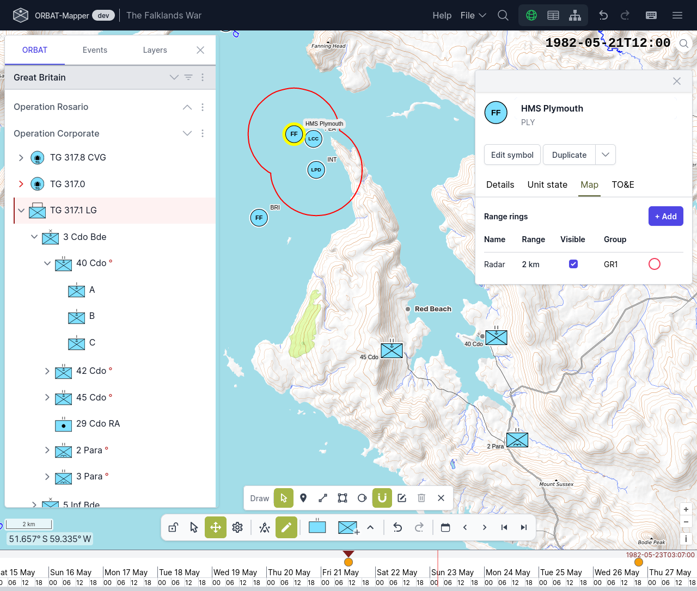

# ORBAT Mapper

ORBAT Mapper is a client side web application. With ORBAT Mapper you can build order of battles (ORBATs) and plot the
locations of units on a map. You can make historic battles and military scenarios again in your browser.

**This project is work in progress.** You can try the current version at https://orbat-mapper.app/. You can read the
documentation at https://docs.orbat-mapper.app/.

_Screenshot:_

ORBAT Mapper is an open-source project with an MIT license. Thus, you can freely use, change and give the source code
to other persons. You must obey the conditions of the license.

You can make a fork and adapt ORBAT Mapper for your applications. But be careful, because the project changes quickly.

## Get started

Obey these steps to run ORBAT Mapper on your computer, or to make your own version of ORBAT Mapper.

Clone the repository:

    $ git clone https://github.com/orbat-mapper/orbat-mapper.git

Go to the project root:

    $ cd orbat-mapper

Install the dependencies:

    $ pnpm install

Start a development server:

    $ pnpm run dev

ORBAT Mapper now runs on http://localhost:5173/. When you change the source code, Vite sends the changes immediately to
the browser.

Make an optimized and minified build:

    $ pnpm run build

This command writes the optimized build to the `dist` directory. Then you can supply this build on your computer:

    $ pnpm run preview

Make a standalone build, that is one HTML file that runs from your disk without a web server:

    $ pnpm run build:singlefile

For the different deployment options, see https://vitejs.dev/guide/static-deploy.html.

## Use ORBAT Mapper without an internet connection

ORBAT Mapper is a static client side web application. It can operate without an internet connection, but you must first
tell it where to find the map data. There are three ways to do this:

1. **Self-hosted** — supply the application from your own web server, and the map data from your own tile server.
2. **Local map file** — supply the application from a web server, and read the basemap from a PMTiles archive on your
   disk.
3. **Standalone file** — run the application as one HTML file from your disk, with a PMTiles archive on your disk.

The place name search sends requests to [Photon](https://photon.komoot.io/). This function needs an internet connection
in all three cases. There is no offline replacement.

For the full instructions, the configuration of the basemap layers and the limits of each option, see
[Offline use](https://docs.orbat-mapper.app/guide/offline-use) in the documentation.

## The legacy OpenLayers map (deprecated)

The OpenLayers map is deprecated. Do not use it for new work. It stays available at `/scenario/<scenarioId>/legacy`, and
it reads a different file: [`public/config/mapConfig.json`](public/config/mapConfig.json). The layer types for that file
are in [`layerConfigTypes.ts`](src/geo/layerConfigTypes.ts).
