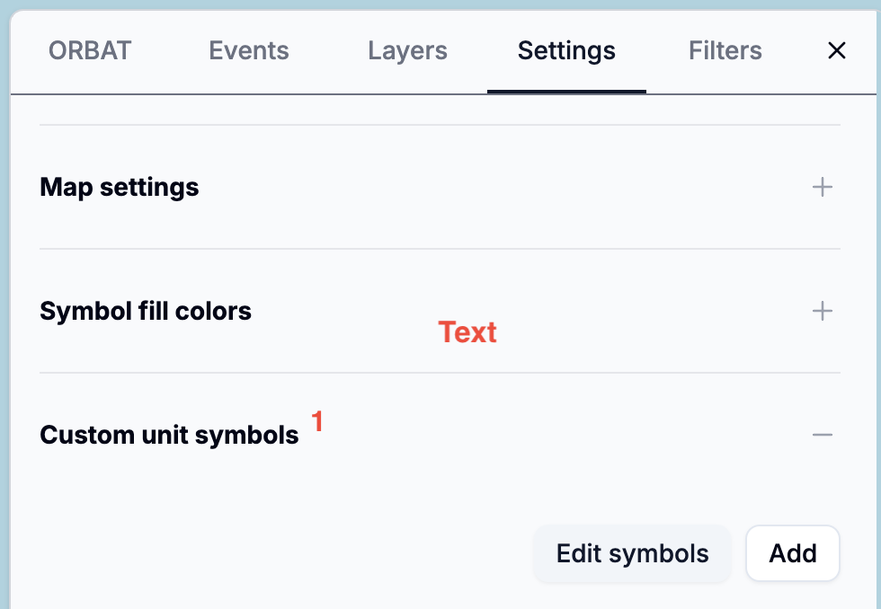
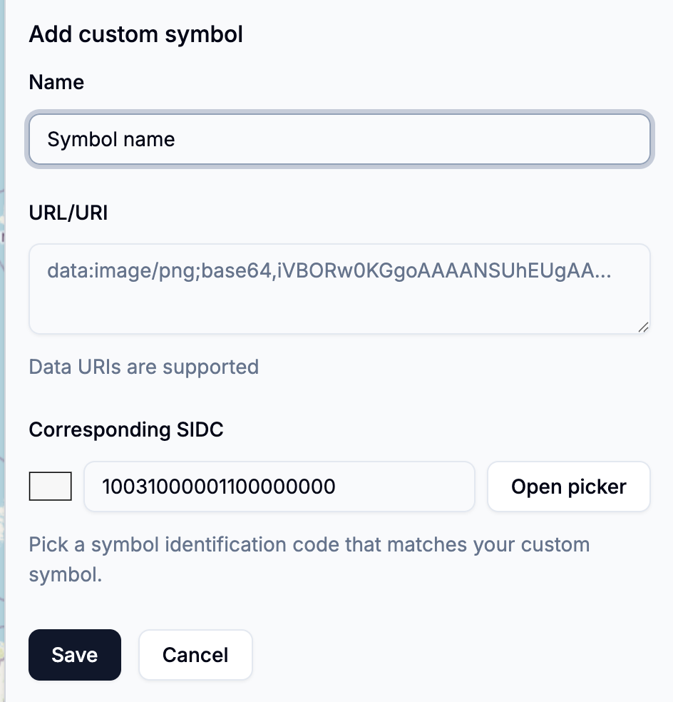

# Custom symbols

If standard military symbols are not sufficient for your needs, you can create custom unit symbols using images and SVGs.

## Adding custom symbols

To create a custom unit symbol go to the _Settings -> Custom unit symbols_:

Click the _Add_ button to open the _Add custom symbol_ form:

**Name**
Enter a descriptive name for your custom symbol

---

**URL/URI** Provide a URL or Data URL for the symbol image.
Supported input formats:

- [Data URLs](<(https://developer.mozilla.org/en-US/docs/Web/URI/Reference/Schemes/data)>) (base64-encoded images or SVGs, e.g., `data:image/png;base64,...`)
- Regular URLs to image files (e.g., `https://example.com/symbol.png`). Subject to [CORS restrictions](https://developer.mozilla.org/en-US/docs/Web/HTTP/Guides/CORS).

:::info
Data URLs are a way to embed small files directly within web pages or applications
by encoding the file’s data in base64 format and placing it inline as a string.
Data URIs typically start with a scheme like data:image/png;base64, followed by the encoded content. For more details,
see the [MDN documentation on Data URLs](https://developer.mozilla.org/en-US/docs/Web/URI/Reference/Schemes/data).

Custom symbols added using Data URLs are stored directly in the scenario file, making them portable and self-contained.
However, be aware that large Data URLs can increase the size of your scenario file significantly.
:::

Supported image formats:

- PNG
- SVG
- JPEG/JPG
- and other formats supported by web browsers

The recommended image formats are SVG and PNG with transparent backgrounds. SVG images can be scaled to any size without loss of quality and
are usually smaller than raster images.

:::warning
When using external URLs, make sure you have permission to use the image and that the server hosting the image allows cross-origin requests.
[Hotlinking](https://en.wikipedia.org/wiki/Inline_linking) images from other websites without permission may violate their terms of service.
:::

---

**Corresponding SIDC**. The Symbol Identification Code (SIDC) that corresponds to your custom symbol. This value is used
for filtering and selecting units. It may also be used when exporting data to formats that support SIDCs.

After you have added your custom symbol, it will appear in the list of available custom symbols:

## Using custom symbols

## Troubleshooting

If your custom symbol does not appear as expected, check the following:

- Ensure the URL or Data URL is correct and accessible. The easiest way to test this is to open the URL in a web browser.
- If the symbol shows up in the list of custom symbols but not on the map, check for any [CORS-related issues](https://developer.mozilla.org/en-US/docs/Web/HTTP/Guides/CORS/Errors). Modern browsers
  enforce CORS policies that may prevent loading images from certain external sources. If you suspect a CORS issue, try hosting the image on a different server or use a Data URL instead.
