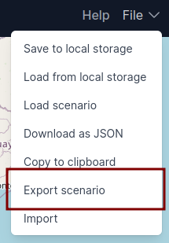
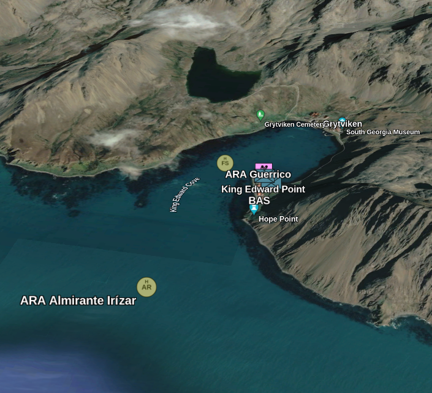

# Export data

ORBAT Mapper can export units and features to several data formats:

- [GeoJSON](#geojson)
- [KML/KMZ](#kml)

## Start the export process

To start the import process
select _Import_ from the _File_
menu.

## GeoJSON

## KML

ORBAT Mapper does not support a 3D view, but you kan export you scenario as KMZ and view your scenario in Google Earth.

