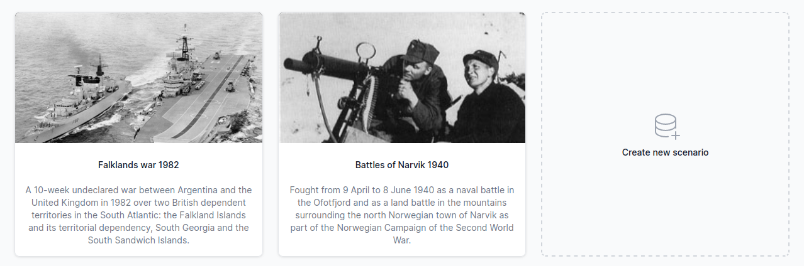

# Getting started

Start using ORBAT Mapper either by opening one of the demo scenarios or by selecting the _Create new scenario_ option.

## Terminology

A scenario consists primarily of _units_ organized into _groups_ and _sides_. A side typically represents a nation or
coalition. Each side is divided into one or more groups of units. The topmost unit in a hierarchy is called a _root
unit_.

How you organize a scenario is up to you. One example is the Falklands demo scenario. It consists of two sides, Great Britain and Argentina.

