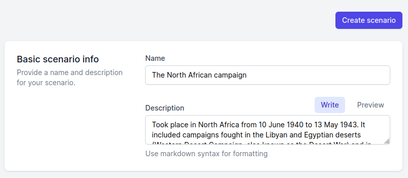
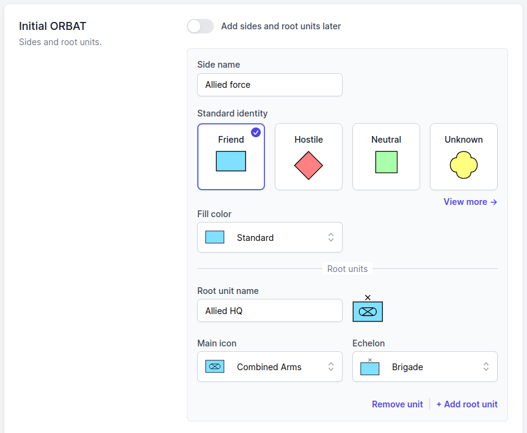
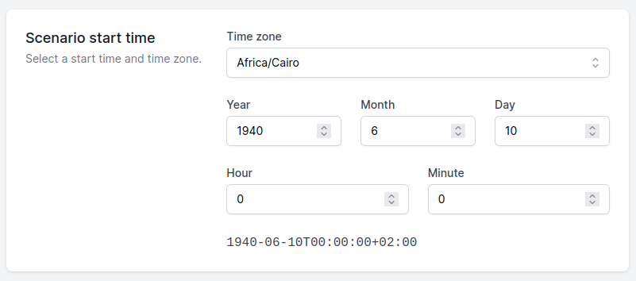
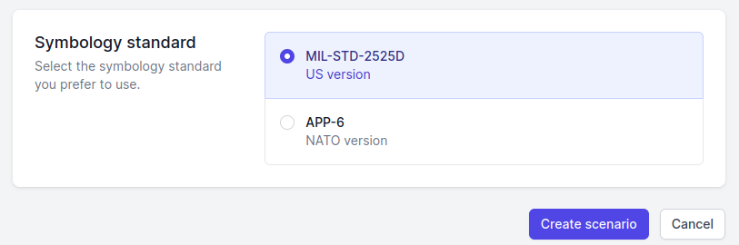

# Getting started

Start using ORBAT Mapper either by opening one of the demo scenarios or by selecting the _Create new scenario_ option.

## Create new scenario

When you select the _Create new scenario_ option you can enter som basic information about the scenario first or jump
right
into the scenario editor by clicking the _Create scenario_ button.

Start by adding a name and description:

Next you can add an initial ORBAT to get you started. Enter name of sides, root units and select the standard identity
for each side. The standard identity determines the color and shape of the unit icons. Additionally, you can change the
symbol fill color. You can also assign unit icons and echelons. If you can't find the right icon don't worry. Only a
small subset is displayed. You can change the icons later.

Next you can set the scenario start time and time zone. For historical scenarios this is an important setting.

The last step is to select the symbology standard. You can read more about the differences in
the [military symbology section](./military-symbology.md#differences-between-milstd-2525d-and-app-6d) of the
documentation.

You are now ready to create your scenario. Click the _Create scenario_ button and you'll be redirected to the scenario
editor.
