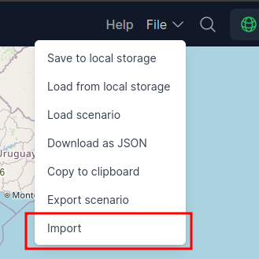
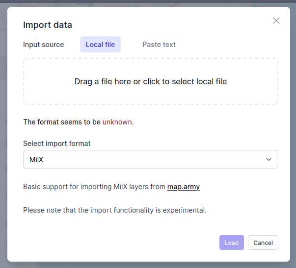
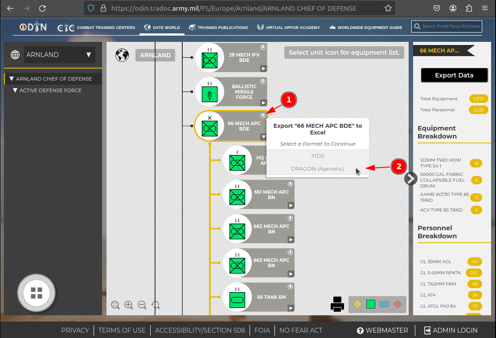

# Import data

ORBAT Mapper can import units and features from the following sources and formats:

- [GeoJSON](#geojson)
- [MilX](#milx)
- [Spatial Illusions ORBAT Builder](#spatial-illusions-orbat-builder)
- [Order of Battle Generator](#order-of-battle-generator)
- [Decisive Action Training Environment (DATE) force structures](#decisive-action-training-environment-date-force-structures)

Additionally, you can import KML/KMZ files as temporary map layers.
See [Working with map background layers](map-layers.md)

## Start the import process

To start the import process select _Import data_ from the _File_ menu.

This will open the _Import data_ dialog shown below. You can also simply drag and drop a supported file onto the map to
start the import process. Select the file you want to import and click _Load_. In many cases ORBAT mapper will guess the
correct import format automatically. If not, you can select the correct format from the _Select import format_ dropdown.

## GeoJSON

## MilX

[MilX (common military exchange format)](https://www.gs-soft.com/CMS/en/products/mssstick-mss-and-milx/milx) is an
XML-based format for exchanging military map overlays. It is for instance used by the
excellent [map.army](https://www.map.army/) tool for storing map overlays. ORBAT Mapper supports loading of
overlays from map.army. Both compressed (`.milxlyz`) and uncompressed (`.milxly`) files are supported.
.

::: info
Please note that ORBAT Mapper only supports a small subset of the MilX format. A potential compatability issues is that
Map.army uses letter based MILSTD 2525C/APP6-C symbol codes. ORBAT Mapper will try its best to convert them to
2525D/APP6-D, but this process may fail for some symbols.
:::

## Spatial Illusions ORBAT Builder

[Spatial Illusions ORBAT Builder](https://www.spatialillusions.com/unitgenerator/) is a tool for creating military
symbols and ORBATs. The tool supports exporting of ORBATs in a simple JSON format that is supported by ORBAT Mapper.

## Order of Battle Generator

Import from [Order of Battle Generator](https://www.orbatgenerator.com/).

## Decisive Action Training Environment (DATE) force structures

The [Decisive Action Training Environment World](https://odin.tradoc.army.mil/DATEWORLD) is a training environment
provided by the U.S. Army. To import a DATE World force structure, first download the force structure from the DATE
World website as shown in the screenshot below. Each unit in the force structure viewer has a small export button in
the upper right corner. Click on the export button and select the _DRAGON (Agnostic)_ format. This will download a
`.xlsx` file to your computer containing every unit, equipment and personnel in the force structure.

::: warning
The DATE World force structures are massive and may contain thousands of units. Importing huge force structures will affect
the performance of ORBAT Mapper. It is recommended to import smaller subsets of the force structures.
:::

After you have downloaded the `.xlsx` file, you can import it into ORBAT Mapper by opening the _Import data_ dialog or
by dragging and dropping the `.xlsx` file onto the map. ORBAT Mapper will automatically detect it as a DATE World force
structure.

**Import options**

- **Parent unit**. Shows a list of existing root units in the scenario. Remember that you can always move units around
  after the import is complete.
- **Expand templates**. DATE World force structures use templates to define the structure of units. If this option is
  enabled, ORBAT Mapper will expand the templates and import all units in the force structure. If it is disabled, only
  the top level units will be imported.
- **Include equipment**. If this option is enabled, ORBAT Mapper will import equipment from the unit templates and
  include it in the unit's TO&E.
- **Include personnel**. If this option is enabled, ORBAT Mapper will import personnel from the unit templates and
  include it in the unit's TO&E.

