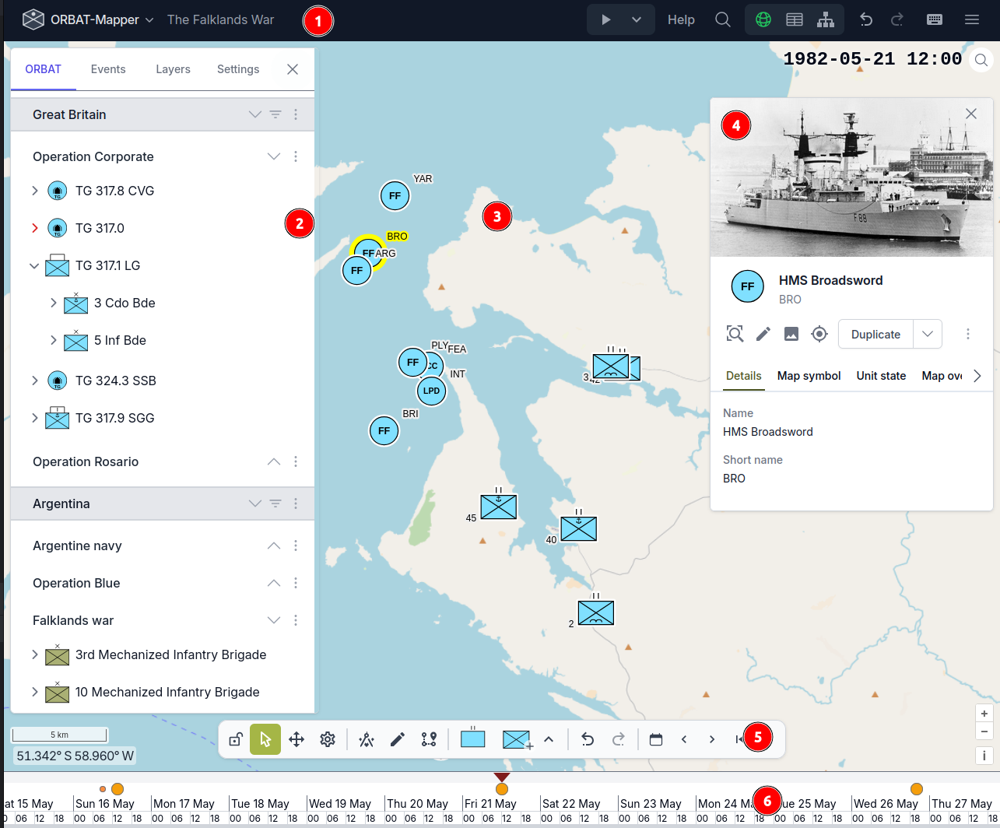
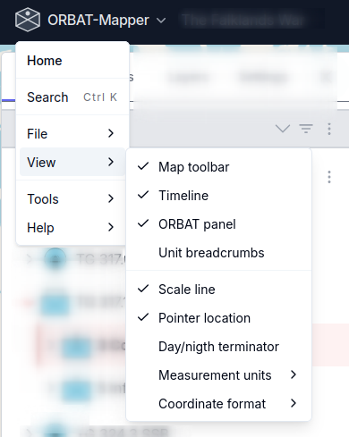

# Map edit mode

The map edit mode is the primary editing mode and consists of the following main parts:

1. Navigation bar
2. Main/ORBAT panel
3. Map
4. Details panel
5. Map toolbar
6. Timeline

## Navigation bar

The navigation bar is located at the top of the screen and contains the following items:

- file menu
- scenario name
- playback menu
- help and search
- editing mode switcher
- undo/redo buttons
- keyboard shortcuts
- settings menu (hambuger menu)

### File menu

From the file menu you can access most scenario related actions such as saving, loading, importing and exporting data.
You also have easy access to various settings and tools.

## Main/ORBAT panel

## Map

## Details panel

## Map toolbar

## Timeline
