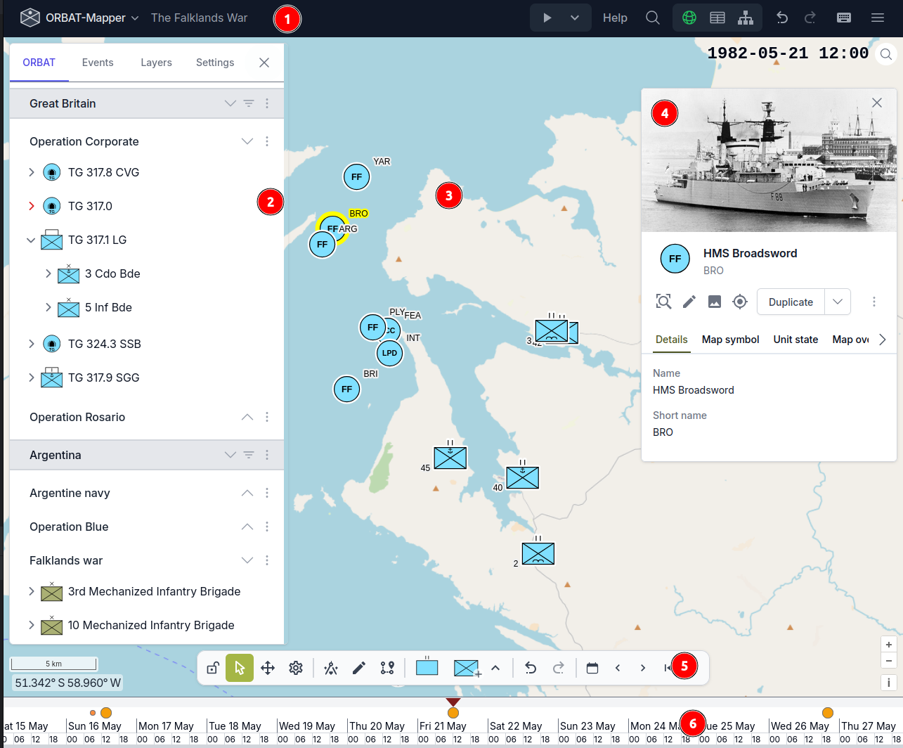
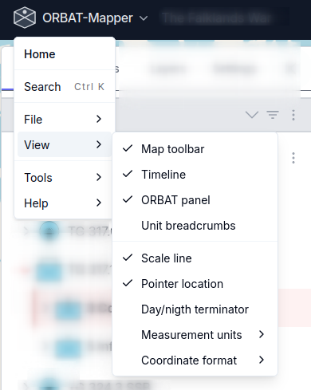

# Map edit mode

The map edit mode is the primary editing mode and consists of the following main parts:

1. Navigation bar
2. Main/ORBAT panel
3. Map
4. Details panel
5. Map toolbar
6. Timeline

## Navigation bar

The navigation bar is located at the top of the screen and contains the following items:

- file menu
- scenario name
- playback menu
- help and search
- editing mode switcher
- undo/redo buttons
- keyboard shortcuts
- settings menu (hambuger menu)

### File menu

From the file menu you can access most scenario related actions such as saving, loading, importing and exporting data.
You also have easy access to various settings and tools.

## Main/ORBAT panel

The ORBAT panel on the left side displays the hierarchical order of battle — sides, groups,
and units — as an expandable tree.

### Browsing and selecting

- Click a unit to select it. **Shift+click** to range-select, **Ctrl/Cmd+click** to
  toggle individual selections.
- Use the **arrow keys** to navigate the tree.
- Expand or collapse units with the chevron icon, or use the side-level expand/collapse
  actions to open or close an entire side at once.
- Use the **filter field** at the top to search units by name. A location filter toggle
  narrows results to units near the current map view.

### Drag and drop

- Drag units to reorder them or move them to a different parent.
- **Ctrl/Cmd+drag** duplicates the dragged units.
- **Ctrl/Cmd+Alt+drag** duplicates units including their state (positions and timeline data).
- Multiple selected units can be dragged together.

### Clipboard

- **Ctrl/Cmd+C** copies selected units. **Ctrl/Cmd+V** pastes them into the target unit.

### Context menus

Right-click or use the dropdown menu on sides, groups, or units to access actions such as
edit, duplicate, move up/down, lock/unlock, hide/show, and delete.

Locked units and groups cannot be dragged or modified.

## Map

The map is the central workspace where units are displayed as military symbols and map features
are drawn.

### Interacting with units

- **Click** a unit symbol to select it. **Shift+click** to add to the selection, or
  **drag a box** on the map to select all units within the area.
- **Drag** a unit to move it to a new position (requires Unit position recording to be
  enabled).
- Unit symbols include configurable rotation and labels showing unit names.

### Drawing map features

Use the **draw toolbar** to create map features:

- Supported geometry types: **Point**, **Line**, **Polygon**, and **Circle**.
- A **freehand** mode is available for lines and polygons.
- Switch to **edit mode** to modify vertices of existing features, or **translate mode** to
  move entire features.

### Map layers

The layers panel lets you manage feature layers, base map layers (XYZ tiles, TileJSON, KML),
and overlays. Each layer supports visibility toggles, zoom-to, reordering, and deletion.
Optional overlays include range rings and day/night shading.

## Details panel

The details panel appears on the right when a unit or map feature is selected. It shows
contextual information and editing controls.

### Unit details

When a unit is selected, the panel shows:

- **Details** — name, short name, description, external URL, and initial location.
- **Map symbol** — SIDC code and symbol appearance options.
- **Unit state** — timeline entries showing position changes, status updates, and other
  recorded state at each timestamp.
- **TO&E/S** — table of organization, equipment, and supplies.
- **Properties** — max speed and average speed with selectable units of measure.

Actions available from the panel include zoom to unit, set location, duplicate, move in
hierarchy, show in ORBAT tree, and delete.

### Feature details

When a map feature is selected, the panel shows:

- **Style** — stroke color and width, fill, arrows (for lines), marker style (for points),
  and text labels.
- **Details** — name, description, and media.
- **State** — time-based state entries for the feature.

## Map toolbar

The map toolbar includes select, move, and rotate modes for units. Rotate mode lets you
drag on a unit (or selected units) to adjust symbol rotation at the current scenario time.

## Recording

Recording controls determine which types of changes are captured on the scenario timeline as you
edit. The **Rec** button in the toolbar shows the current recording state.

### Recording modes

There are three independent recording modes that can be toggled on or off:

- **Unit position** — records changes to unit locations on the map. This is the only mode
  enabled by default, so moving units on the map is immediately timeline-tracked. If this mode is
  off, dragging units to new positions on the map is disabled.
- **Unit hierarchy** — records changes to unit organizational structure. When enabled,
  dragging a unit to a new parent or reordering units in the ORBAT panel creates a timestamped
  entry on the timeline instead of changing the hierarchy directly.
- **Feature geometry** — records changes to map feature shapes (points, lines, polygons).
  When enabled, drawing or editing a feature's geometry creates a timeline entry rather than
  modifying the feature directly.

All recorded changes are tied to the current scenario time. When you scrub the timeline, the
scenario shows the projected state at each point in time based on the recorded entries.

### Using the Rec button

Click the **Rec** button to toggle recording on and off:

- When recording is active, a red indicator and icons show which modes are enabled.
- Clicking the button stops all recording.
- Clicking it again resumes your previous recording configuration — the app remembers your
  last selection.

Use the dropdown menu (right side of the button) to open **Recording Settings**, where you can
toggle each recording mode independently.

## Timeline

The timeline is displayed at the bottom of the map editor and shows the scenario's time range.
An amber histogram indicates where unit events are concentrated.

### Navigating time

- **Click** anywhere on the timeline to jump to that point in time.
- **Drag** left or right to scrub through the scenario.
- **Scroll wheel** to zoom in and out.
- **Event markers** (amber circles) represent scenario events — click one to jump to it.

The current scenario time is shown in the time controller above the timeline, which also has
buttons to step to the previous/next day or previous/next event.

### Playback

Use the playback controls to animate the scenario over time:

- **Play/Pause** starts or stops automatic time progression.
- **Speed** can be increased or decreased (doubles or halves each step).
- **Looping** replays the selected time range continuously.
- **Range markers** let you set start and end bounds for playback.

### Context menu

Right-click the timeline to access additional options:

- Zoom in / Zoom out
- Add a scenario event at the clicked time
- Hide the timeline
