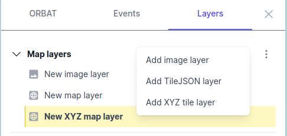

# Working with map background layers

ORBAT Mapper supports the following background layer sources:

Raster layers:

- [XYZ tiles](#xyz-tiles)
- [TileJSON](#tilejson)
- [Images](#images)

Vector layers:

- [KML/KMZ](#kml-kmz)

## XYZ tiles

XYZ map tiles use a grid system to break up a map into small square tiles that can be loaded quickly in a web browser.
Each tile is a small image that covers a small area of the map, and the XYZ system allows for easy indexing and
retrieval of these tiles.

## TileJSON

[TileJSON](https://github.com/mapbox/tilejson-spec/tree/master/3.0.0) is a JSON based format designed to easily describe
a set of XYZ map tiles. The advantage of using TileJSON over XYZ tiles is that TileJSON usually contains information
about
attribution, available zoom levels and extent.

## Images

An image layer is simply a single image that is displayed on top of the map at a specific location. You can rotate and
scale it to fit the map.

## KML/KMZ

You can add a KML or KMZ file as a temporary map layer by dragging and dropping it onto the map. You can also use
the [import-data](import-data).
dialog. If you select the "Extract KML styles" option, ORBAT mapper will try to use images and styles embedded in the
file.

Please note that KML/KMZ are stored in memory, so don't add too many of them. They are only meant to be used as
temporary reference layers, and you currently cannot save them as part of the scenario.
