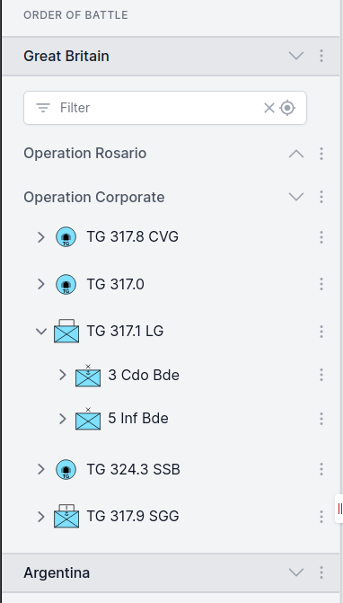

# Terminology

Under the hood ORBAT Mapper uses a data model loosely inspired by
the [Military Scenario Definition Language (MSDL)](https://en.wikipedia.org/wiki/Military_Scenario_Definition_Language).
In this section we will go through some terminology you will encounter while building a scenario.

## Sides and groups

A scenario consists of _units_ organized into _groups_ and _sides_. A side typically represents a nation or
coalition. In a WWII scenario the sides would typically be _Allied forces_ and _Axis forces_.

For each side you can specify a standard identity / affiliation. The standard identity determines the color and shape
of the unit icons. The most commonly used ones are friend, neutral and hostile:

    <DocMilSymbol sidc="10031000000000000000" />
    <DocMilSymbol sidc="10041000000000000000" />
    <DocMilSymbol sidc="10061000000000000000" />
    
Friend

    
Neutral

    
Hostile

You can also select custom colors. This is useful in cases when you do not want to label a side as hostile or want to
distinguish different nations by symbol color.

    <DocMilSymbol sidc="10031000000000000000" :modifiers="{fillColor: '#aab074'}"/>
    <DocMilSymbol sidc="10031000000000000000" :modifiers="{fillColor: '#ffd00b'}"/>
    <DocMilSymbol sidc="10031000000000000000" :modifiers="{fillColor: '#ff3333'}"/>

Each side consists of one or more groups of units. A group is just a way to organize your units. They can for instance
represent branches (army, navy, air-force, etc.), a task force, a battlefront, etc. The default group name is _Units_.

A group consists of one or more unit hierarchies. The topmost unit in a hierarchy is called a _root unit_.

## Units

A unit is the basic building block of a scenario. It has properties like military symbol, name, description, echelon,
location, etc.

    <DocMilSymbol sidc="10031000161211000000" />
    <DocMilSymbol sidc="10031000141205000000" />
    <DocMilSymbol sidc="10061000151301020000" />

### Table of Organization and Equipment (TO&E)

A military unit is composed of personnel and equipment. This composition is often referred to as Table of Organization
and Equipment (TO&E).The TO&E outlines the structure, roles, and responsibilities of personnel within the unit and
specifies the types and quantities of its equipment.

ORBAT mapper has basic support for representing TO&E-data.

## Map layers and features

The map is an important part of a scenario. A scenario map consists of multiple layers. The _base layer_ is drawn first
an on top of that you can add raster _map layers_ and then _feature layers_.

A raster map layer consists of one or more raster images. Typical raster map sources are aerial photos and scanned maps.
Feature layers consists of one or more _features_. A feature is a styled point, line or polygon on the map.

[//]: # "## Events"

[//]: #

[//]: # "How you organize a scenario is up to you. One example is the Falklands demo scenario. It consists of two sides, Great"

[//]: # "Britain and Argentina."

[//]: #

[//]: # ""
