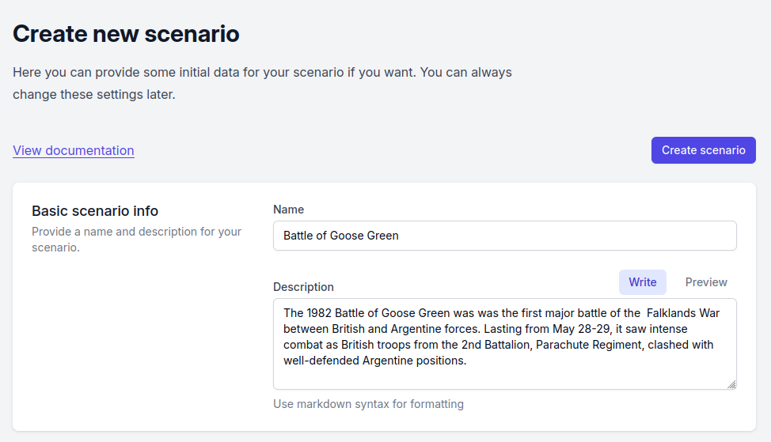
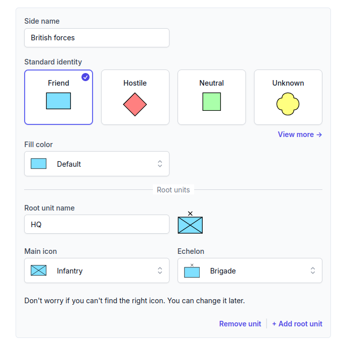
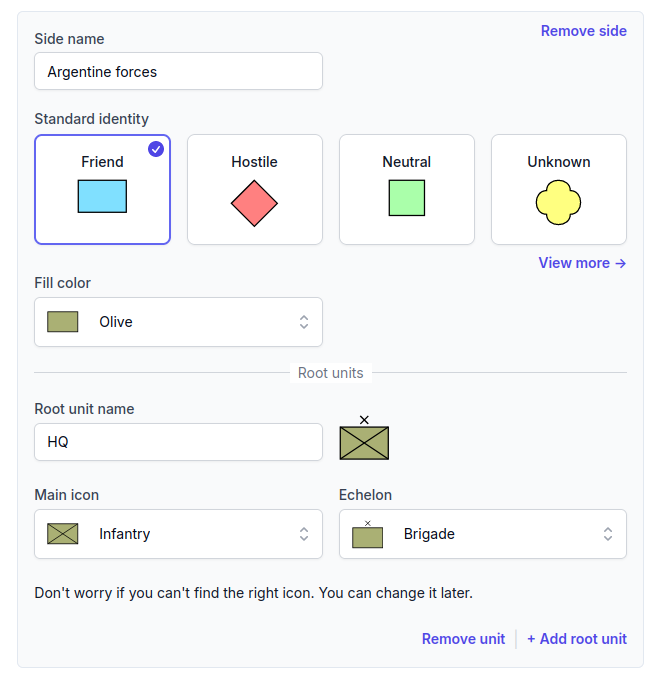
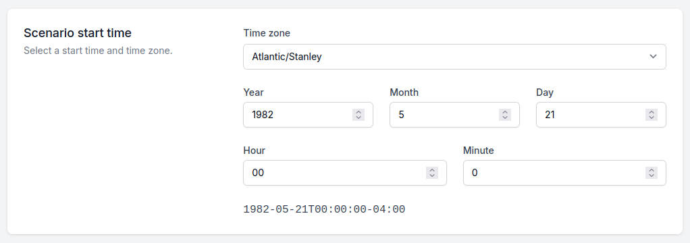

# Getting started

Start by selecting the _Create new scenario_ option on the start page. This will open a
form where you can enter some basic scenario information and an initial ORBAT.

## Create new scenario

Start by adding a name and description:

### Initial ORBAT

Next you can add an initial ORBAT to get you started. For this scenario we will create two sides named _British forces_
and _Argentine forces_. We will change the root units later, so just keep the default root units for now.

The standard identity determines the color and shape of the unit icons. You don't have to use the standard fill colors,
so for this scenario
we will use the _Olive_ fill color for the Argentine forces together with the _Friend_ standard identity shape.

### Scenario start time

For this scenario we will set the start time to 21th of May 1982, the day of the [British
landings](https://en.wikipedia.org/wiki/Operation_Sutton) on the shores of San Carlos Water. For the time zone we will
use the local time zone of the Falkland Islands, which is Atlantic/Stanley (GMT-4).

::: info

British forces used the Greenwich Mean Time (GMT) during the Falklands War. Feel free to use GMT/ZULU time for your
scenario if you prefer.
:::
