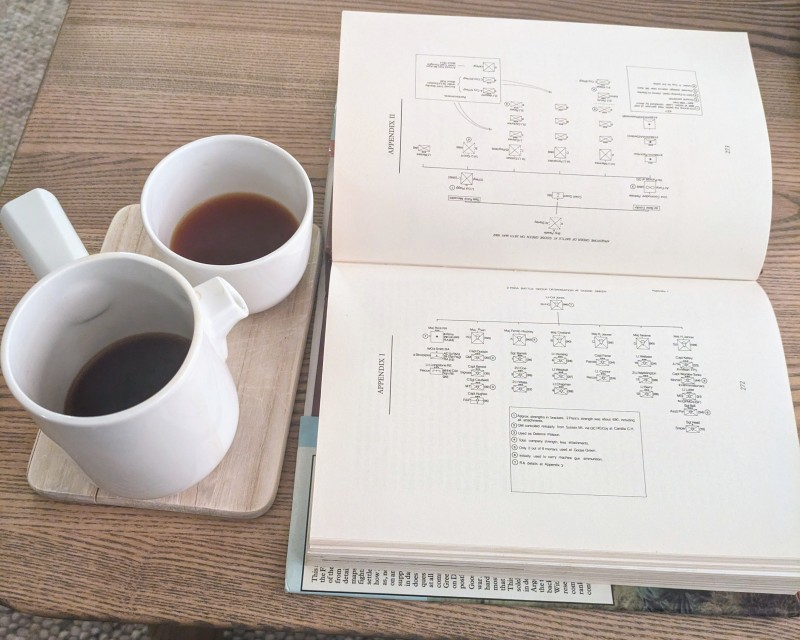

# Research

The initial step in creating a historical scenario typically involves extensive research. Understanding the involved
units, their activities, the timing, and the location is crucial. You want to know as many details as possible
because you have to map the movement of units over time. If you are aiming for accuracy and details, it can
be surprisingly hard to find detailed enough information. Usually you have to consult a wide range of books, documents
and websites.

_Research :heart:_

## Sources

The Falklands War is extensively documented and much of the information is available online. Wikipedia has an
extensive entry on the [Battle of Goose Green](https://en.wikipedia.org/wiki/Battle_of_Goose_Green), but to get enough details
you may have to consult some of the books in the [sources section](https://en.wikipedia.org/wiki/Battle_of_Goose_Green#Sources).
Two highly recommended books are:

- Adkin, Mark (1992). _Goose Green – A battle is Fought to be Won_. London: Pen & Sword Books Ltd. ISBN
  978-0-85052-207-5.
- Fitz-Gibbon, Spencer (2002). _Not Mentioned in Despatches: The History and Mythology of the Battle of Goose Green_.
  Lutterworth Press. ISBN 0-7188-3016-4.

::: tip
Many libraries allow you to borrow and read books online. [The Internet archive](https://archive.org/) also have books,
including
[several books about the Battle of Goose Green](https://archive.org/search?query=title%3A%28goose%20green%29).
:::
