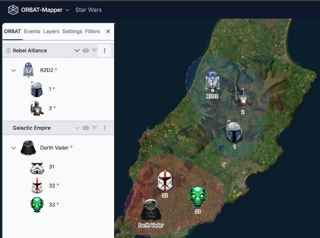
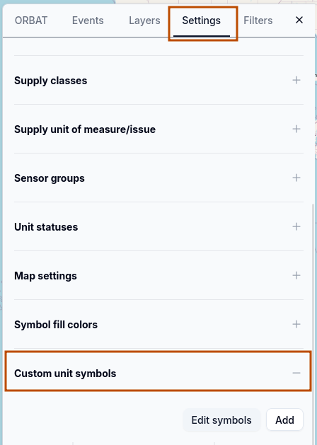
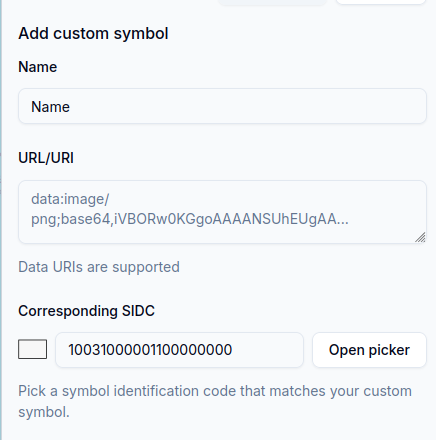
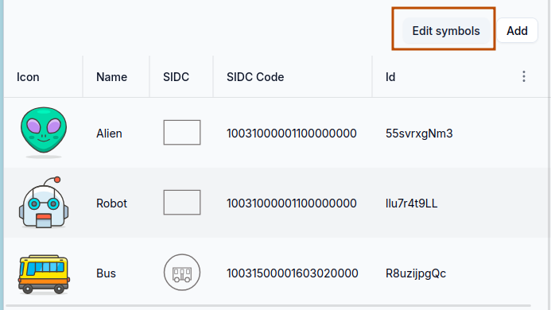
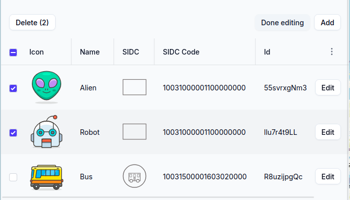
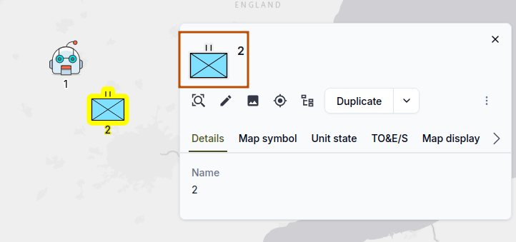
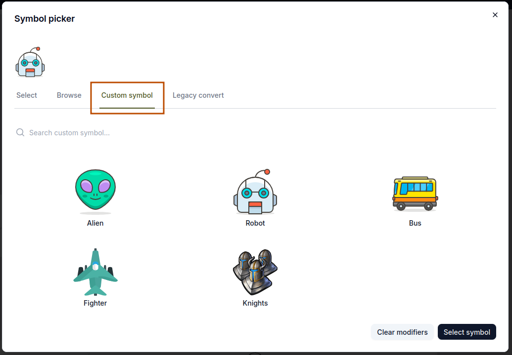

# Custom symbols

If the standard military symbols are not sufficient, you can make custom unit symbols from images and SVG files.

## Add custom symbols

To make a custom unit symbol, go to _Settings -> Custom unit symbols_:

Click the _Add_ button. The _Add custom symbol_ form opens:

**Name**
Give a descriptive name to your custom symbol.

---

**URL/URI** Give a URL or a Data URL for the image of the symbol.
These input formats are permitted:

- [Data URLs](https://developer.mozilla.org/en-US/docs/Web/URI/Reference/Schemes/data) (images or SVG files with base64
  encoding, for example `data:image/png;base64,...`)
- Usual URLs to image files (for example `https://example.com/symbol.png`).
  [CORS restrictions](https://developer.mozilla.org/en-US/docs/Web/HTTP/Guides/CORS) apply to these URLs.

:::info
A Data URL puts a small file directly in a web page or an application. The data of the file has base64 encoding, and
the URL holds it as a string. Usually a Data URI starts with a scheme such as data:image/png;base64. The encoded
content comes after the scheme. For more data, see the
[MDN documentation on Data URLs](https://developer.mozilla.org/en-US/docs/Web/URI/Reference/Schemes/data).

The scenario file holds the custom symbols that you add with Data URLs. Thus, the file is complete and you can easily
move it. But be careful: large Data URLs make the scenario file much larger.
:::

These image formats are permitted:

- PNG
- SVG
- JPEG/JPG
- and other formats that web browsers support

Use SVG or PNG images with transparent backgrounds. These formats give the best results. You can change the size of an
SVG image to any size without a decrease in quality. SVG images are also usually smaller than raster images.

:::warning
If you use external URLs, make sure that you have permission to use the image. Also make sure that the server of the
image permits cross-origin requests.
[Hotlinking](https://en.wikipedia.org/wiki/Inline_linking) of images from other websites without permission can be a
violation of their terms of service.
:::

---

**Corresponding SIDC**. This is the Symbol Identification Code (SIDC) that agrees with your custom symbol. The
application uses this value to filter and to select units. It can also use the value when it exports data to formats
that support SIDCs.

When you add your custom symbol, it comes into the list of available custom symbols:

To change or delete custom symbols, use the "_Edit symbols_" button. As an alternative, double-click on a row in the
list of custom symbols to open the edit form.

## Use custom symbols

To use a custom symbol, click the symbol icon in the unit details panel. The symbol picker opens:

In the symbol picker, go to the _Custom symbol_ tab to see your custom symbols:

To go back to a standard military symbol, go to the _Browse_ tab and select a symbol from a symbol set.

## Where to find symbol icons

Start here:

- [Iconify.design](https://icon-sets.iconify.design/) A large collection of open-source icon sets.
- [Icônes](https://icones.js.org/) An icon explorer with immediate search. It uses Iconify.
- [Icon Archive](https://iconarchive.com/) A large collection of icon sets in different styles and formats.

Some recommendations:

- Use icons in the SVG format. You can then change their size easily, and the quality stays good.
- Make sure that the icons have transparent backgrounds. This is important for PNG files, because the icons must agree
  with different map backgrounds.
- Read the license terms. Make sure that you have the right to use the icons in your project.
- Do not use large images.
- If you use usual URLs, make sure that the server permits cross-origin requests (CORS).
- Look at the icons on different backgrounds and at different sizes to make sure that you can read them. A thin outline
  or a shadow can make them easier to see.

## Troubleshooting

If your custom symbol does not show correctly, do these checks:

- Make sure that the URL or the Data URL is correct and that you can get access to it. To do this test, open the URL in
  a web browser.
- If the symbol shows in the list of custom symbols but not on the map, look for
  [CORS problems](https://developer.mozilla.org/en-US/docs/Web/HTTP/Guides/CORS/Errors). Modern browsers obey CORS
  policies, and these policies can prevent the load of images from some external sources. If you think that there is a
  CORS problem, put the image on a different server or use a Data URL.
