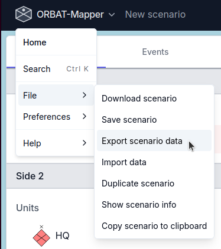
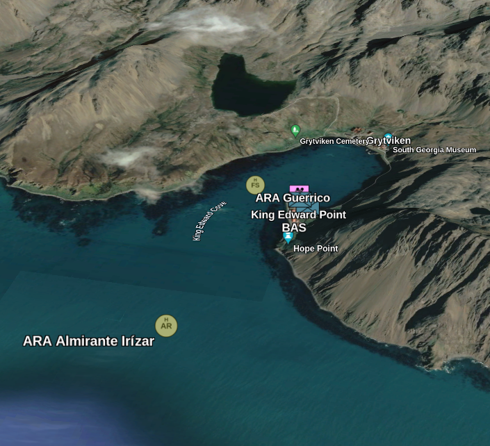

# Export data

ORBAT Mapper can export units and features to these data formats:

- [ORBAT Mapper](#orbat-mapper)
- [GeoJSON](#geojson)
- [KML/KMZ](#kml)
- [MilX](#milx)
- [XLSX](#xlsx)
- [Spatial Illusions ORBAT Builder](#spatial-illusions-orbat-builder)

## Start the export

To start the export, select _Export scenario_ from the _File_ menu.

## ORBAT Mapper

Choose **ORBAT Mapper** to export selected side groups and layers as a scenario file.
For a side without groups, select **Include side** to include it in the file.
The scenario name and filename are suggested from the source name and selected sides
(for example, **Northern Exercise — Blue** and `northern-exercise-blue.json`).
Layers-only exports use a **Layers** suffix; exporting all content keeps the source name.
Suggestions update with your selections until you edit the corresponding field.
Names loaded from a preset are preserved. You can add a turn label manually, such as **Turn 3**.

### Reuse an export preset

Select the groups and layers for a recipient, expand **Export presets**, and enter a **Preset name** (for example,
“Blue contacts update”), and click **Save as new preset**. A preset remembers the
selected groups, empty sides and layers, scenario name, and filename.

Choose a **Saved preset** to restore its settings. After making changes, click
**Update preset** to save them, or **Save as new preset** to keep another variation.
**Delete preset** removes the saved preset without changing the current selection.

Presets are stored in this browser for the current scenario; they are not included
in downloaded scenario files. New groups and layers are not automatically added.
If a saved group or layer has been deleted, loading the preset omits it and displays
a notice. Review the selection before exporting.

### Preview recipient data

Click **Preview recipient data** to inspect included groups, unit counts, layers,
and scenario-wide data. Expand entries to inspect their stored contents, or expand
**Inspect complete recipient data** to see everything together. The preview updates
when you change your selections.

Hidden units and layers are still included when their group or layer is selected.
Descriptions, events, templates, catalogs, settings, and stored unit histories may
also contain information you do not intend to share. Group and layer selection does
not remove scenario-wide data. Review these contents before distributing a file.
The downloaded file receives a new scenario ID and export timestamp.

## GeoJSON

GeoJSON is an open standard format that many applications use. It gives simple geographical features with their
non-spatial attributes.

## KML

KML (Keyhole Markup Language) is a format that uses XML. Mapping applications such as Google Earth use it to show
geographic data. When you export to KML, you can easily send your scenario data to usual geospatial tools and show it
there. For more data, see the [KML documentation](https://developers.google.com/kml/documentation).

Control measures are exported as their complete rendered geometry with resolved line,
fill, opacity, width, and label styling. KML has no portable dash-pattern or patterned-fill
primitive, so those paint details use a solid fallback in KML/KMZ viewers.

KMZ export offers two control-measure label modes. **Native** keeps labels searchable and
compact, but KML viewers draw them upright. **Rendered** embeds labels and text amplifiers
as transparent images so their orientation, pixel size, anchor, typography, background,
and halo are retained. Plain KML always uses native labels because it cannot package the
required image assets.

## XLSX

Export units to the Microsoft Excel format (`.xlsx`). Use this format to send unit data to spreadsheet applications, or
to do more analysis.

### Export options

- **One sheet per side**: If you enable this option, the export makes one worksheet for each side in the scenario. If
  you disable it, the export puts all the units in one sheet.

### Unit attributes

Select the unit attributes for the export:

| Attribute   | Description                       |
| ----------- | --------------------------------- |
| id          | Unique unit identifier            |
| name        | Unit name                         |
| sidc        | Symbol Identification Code (SIDC) |
| shortName   | Abbreviated unit name             |
| description | Unit description                  |
| url         | External URL                      |
| location    | Current position of the unit      |
| parent ID   | ID of the parent unit             |
| side ID     | ID of the side of the unit        |
| side name   | Name of the side                  |

### Location format

Select the format of the coordinates in the export:

| Format                  | Example                |
| ----------------------- | ---------------------- |
| JSON array [lon, lat]   | `[10.7522, 59.9139]`   |
| Lat, Lon                | `59.9139, 10.7522`     |
| Lon, Lat                | `10.7522, 59.9139`     |
| MGRS                    | `32VNM8546314523`      |
| Degrees Minutes Seconds | `59°54'50"N 10°45'8"E` |
| Decimal Degrees         | `N59.9139° E10.7522°`  |

## MilX

ORBAT Mapper has experimental support for the export of a scenario as MilX layers. You can use these layers
with [map.army](https://map.army).

::: warning
ORBAT Mapper supports only a small part of the MilX format. There is also an important compatibility problem.
Map.army uses MILSTD 2525C/APP6-C symbol codes with letters. It is not always possible to change 2525D/APP6-D codes
into 2525C/APP6-C codes. ORBAT Mapper tries to find the symbol that agrees most closely, but this operation can fail.

:::

## Spatial Illusions ORBAT Builder
