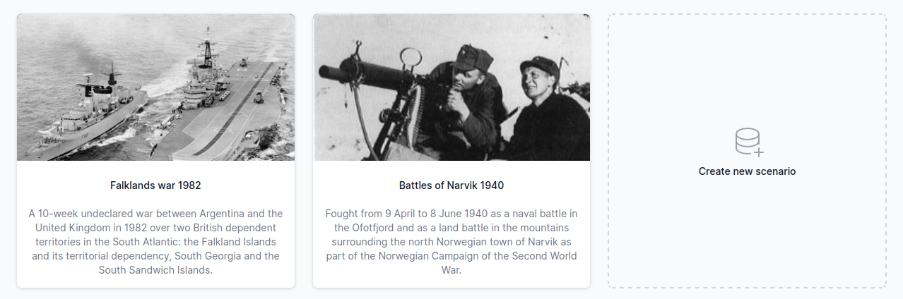
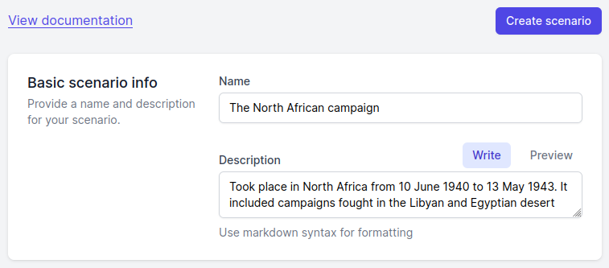
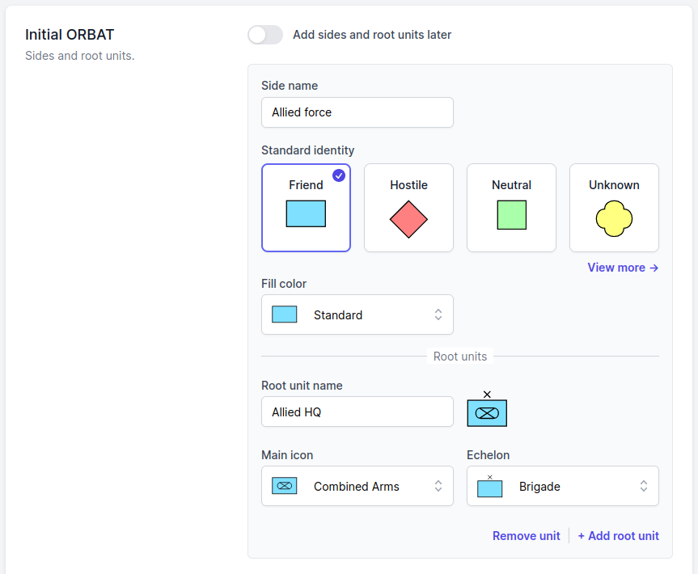
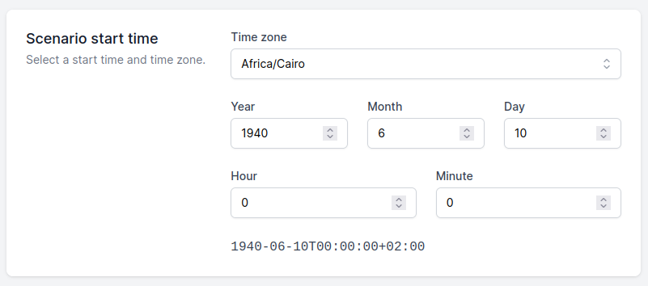
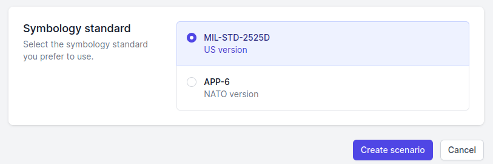

# Getting started

To start with ORBAT Mapper, open one of the demo scenarios. As an alternative, select the _Create new scenario_ option.

## Create a new scenario

When you select the _Create new scenario_ option, you can first give basic data about the scenario. As an alternative,
click the _Create scenario_ button to go immediately to the scenario editor.

First, add a name and a description:

Then you can add an initial ORBAT. Give the names of the sides and the root units. Select the standard identity for
each side. The standard identity controls the color and the shape of the unit icons. You can also change the fill color
of the symbol, and you can select unit icons and echelons. The form shows only a small quantity of the icons. If you
cannot find the correct icon, continue. You can change the icons later.

Then you can set the start time and the time zone of the scenario. For historical scenarios, this setting is important.

The last step is the selection of the symbology standard. The
[military symbology section](./military-symbology.md#differences-between-milstd-2525d-and-app-6d) of this documentation
gives more data about the differences.

The scenario is now ready. Click the _Create scenario_ button. The application then shows the scenario editor.
