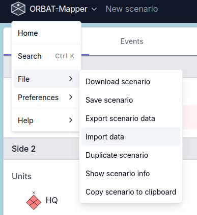
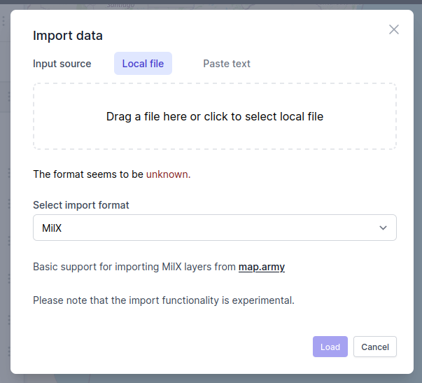
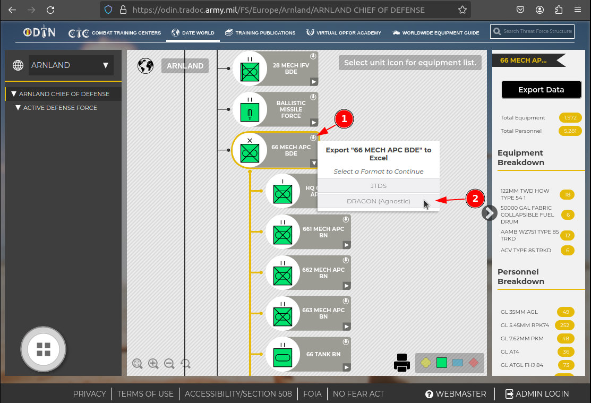

# Import data

ORBAT Mapper can import units and features from these sources and formats:

- [ORBAT Mapper scenarios](#orbat-mapper-scenarios)
- [GeoJSON](#geojson)
- [MilX](#milx)
- [Spatial Illusions ORBAT Builder](#spatial-illusions-orbat-builder)
- [Order of Battle Generator](#order-of-battle-generator)
- [Decisive Action Training Environment (DATE) force structures](#decisive-action-training-environment-date-force-structures)

You can also import KML/KMZ files as temporary map layers.
See [Work with map background layers](map-layers.md).

## Start the import

To start the import, select _Import data_ from the _File_ menu.

The _Import data_ dialog opens. You see it below. As an alternative, drag a supported file and drop it on the map to
start the import. Select the file for the import and click _Load_. Usually ORBAT Mapper finds the correct import format
automatically. If it does not, select the correct format from the _Select import format_ dropdown list.

## ORBAT Mapper scenarios

Use **Side** or **Group** import to add or update data in your current scenario
from another scenario file. Choose the side or group you want to import.
To update only part of a side, use **Group** import and import each group separately.
Other sides and groups are left unchanged.

- **Update included units** is the default. Select the units to update. Existing
  sides, groups and units are matched by ID, not name. For example, adding a location
  to an existing unit updates that unit without creating a duplicate. Units missing
  from the file retain their fields and parent.
- **Replace entire side/group** treats the incoming scope as complete, including all
  its units. Existing units and groups missing from the file are removed. Inspect the removal list.
- **Import as a separate copy** creates fresh IDs for intentional duplication and
  remaps hierarchy references within the copy.

For included units and groups, incoming authored fields replace existing fields,
including clearing fields absent from the incoming object. Incoming parentage and
sibling order apply to included units; omitted siblings follow them in their existing
order. This is not field-level conflict resolution. References to missing parents or
units outside the selected scope block the import.

**Units only** preserves existing history. **Units with state** also imports history.
**State only** updates matching selected units' history without creating missing units
or changing unit fields or structural parentage. It does not remove omitted units,
even with the replacement action. History can be replaced (an empty history clears it)
or appended. Append ignores states at or before the latest existing timestamp.
Timed hierarchy references in imported history must remain within the selected scope.

Choose import options in the sidebar. The first available side or group is selected
automatically; use the selector above the unit table to choose another.
Use the table's checkboxes to select units; expand rows to see their hierarchy.
The **Changes** column describes each entry's planned changes. Hover over a shortened
description to read it in full.
Turn on **Show changed entries only** to hide unchanged entries. Added entries and
parent rows remain visible, including entries you have unchecked. The filter compares
all incoming entries; the preview and Import button still use your selection.
Filtering does not change your selection; removals are
listed under **Review changes**.
The summary below the table shows the selected action and target, with counts of units
updated, added, removed and left unchanged. Units omitted from an update are identified separately.
Expand **Review changes** for descriptions such as “Location added,” parent changes using
unit names, and counts of history entries added, updated or removed. Expand **Advanced
details** to inspect IDs and the full before-and-after data. Unchanged items are listed
separately in a collapsible section.

Previewing and canceling leave the active scenario untouched. **Import**
uses that same plan.

Use **Undo** immediately after import to revert the entire import in one step.

## GeoJSON

## MilX

[MilX (common military exchange format)](https://www.gs-soft.com/CMS/en/products/mssstick-mss-and-milx/milx) is a
format that uses XML. It exchanges military map overlays. For example, the
excellent [map.army](https://www.map.army/) tool uses it to keep map overlays. ORBAT Mapper can load overlays from
map.army. It supports compressed (`.milxlyz`) and uncompressed (`.milxly`) files.

::: info
ORBAT Mapper supports only a small part of the MilX format. There can also be a compatibility problem, because
map.army uses MILSTD 2525C/APP6-C symbol codes with letters. ORBAT Mapper tries to change them into 2525D/APP6-D
codes, but this operation can fail for some symbols.
:::

## Spatial Illusions ORBAT Builder

[Spatial Illusions ORBAT Builder](https://www.spatialillusions.com/unitgenerator/) is a tool that makes military
symbols and ORBATs. The tool can export ORBATs in a simple JSON format. ORBAT Mapper supports this format.

## Order of Battle Generator

Import data from [Order of Battle Generator](https://www.orbatgenerator.com/).

## Decisive Action Training Environment (DATE) force structures

The [Decisive Action Training Environment World](https://odin.tradoc.army.mil/DATEWORLD) is a training environment of
the U.S. Army. To import a DATE World force structure, first download the force structure from the DATE World website.
The screenshot below shows this operation. In the force structure viewer, each unit has a small export button in the
top right corner. Click the export button and select the _DRAGON (Agnostic)_ format. A `.xlsx` file downloads to your
computer. It contains all the units, the equipment and the personnel of the force structure.

::: warning
The DATE World force structures are very large and can contain thousands of units. If you import a very large force
structure, the performance of ORBAT Mapper decreases. Import smaller parts of the force structures.
:::

When the `.xlsx` file is on your computer, open the _Import data_ dialog to import it. As an alternative, drag the
`.xlsx` file and drop it on the map. ORBAT Mapper identifies a DATE World force structure automatically.

**Import options**

- **Parent unit**. This option shows a list of the root units in the scenario. Remember that you can always move units
  after the import.
- **Expand templates**. DATE World force structures use templates to define the structure of the units. If you enable
  this option, ORBAT Mapper expands the templates and imports all the units of the force structure. If you disable it,
  ORBAT Mapper imports only the units at the top level.
- **Include equipment**. If you enable this option, ORBAT Mapper imports the equipment from the unit templates and puts
  it in the TO&E of the unit.
- **Include personnel**. If you enable this option, ORBAT Mapper imports the personnel from the unit templates and puts
  it in the TO&E of the unit.

## Tabular data (Excel/CSV)

You can import units from Excel (`.xlsx`) or CSV files. Thus, you can use data from spreadsheets and other tools.

### Column mapping

When you import a tabular file, a column mapping screen shows. On this screen, connect the columns of your file to the
properties of the units.

**Necessary fields:**

- **Name**: The name of the unit. This field is mandatory.
- **Icon**: The function of the unit or its symbol code. If you have a full SIDC (15, 20 or 30 characters), map it
  here. If you have a name that persons can read (for example "Infantry"), map it here.
- **Echelon**: The command level of the unit (for example "Platoon" or "Company").

**Validation:**

The importer tries to make a valid SIDC from the mapped **Icon** and **Echelon** columns. If it cannot make a valid
SIDC, or if the name is not available, the importer removes the unit from the import.

### Make a hierarchy

To make a unit hierarchy again, map the **Parent ID** field.

1. **ID field**: Select the column that contains the unique identifier of each unit.
2. **Parent ID**: Select the column that contains the ID of the parent unit.

ORBAT Mapper uses these two fields to build the tree structure again.
