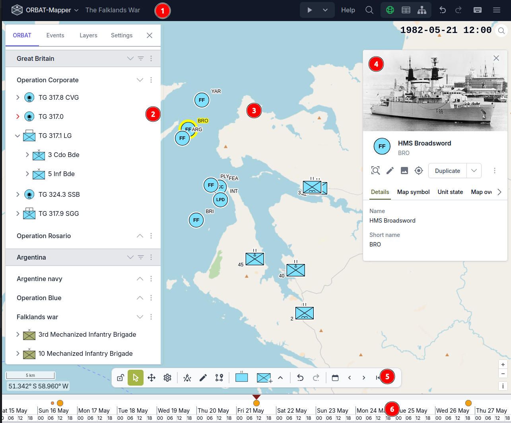
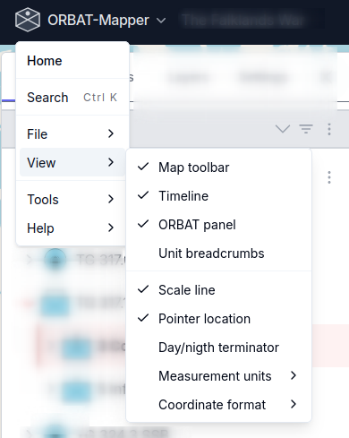

# Map edit mode

The map edit mode is the primary editing mode. It has these main parts:

1. Navigation bar
2. Main/ORBAT panel
3. Map
4. Details panel
5. Map toolbar
6. Timeline

## Navigation bar

The navigation bar is at the top of the screen. It has these items:

- file menu
- scenario name
- playback menu
- help and search
- editing mode switch
- undo/redo buttons
- keyboard shortcuts
- settings menu (hamburger menu)

### File menu

The file menu gives you almost all the scenario actions. These actions include save, load, import and export. The menu
also gives you quick access to different settings and tools.

## Main/ORBAT panel

The ORBAT panel is on the left side. It shows the hierarchy of the order of battle — sides, groups and units — as a
tree that you can expand.

### Browse and select

- To select a unit, click it. To select a range, hold **Shift** and click. To select or deselect one unit, hold
  **Ctrl/Cmd** and click.
- To move in the tree, use the **arrow keys**.
- To expand or collapse a unit, click the chevron icon. To open or close a full side, use the expand/collapse actions
  at the side level.
- To find units by name, use the **filter field** at the top. A location filter switch shows only the units near the
  current map view.

### Drag and drop

- Drag units to put them in a different sequence or below a different parent.
- To make copies of the dragged units, hold **Ctrl/Cmd** and drag.
- To make copies of the units with their state (positions and timeline data), hold **Ctrl/Cmd+Alt** and drag.
- You can drag more than one selected unit at the same time.

### Clipboard

- **Ctrl/Cmd+C** copies the selected units. **Ctrl/Cmd+V** puts them into the target unit.

### Context menus

Right-click a side, a group or a unit, or use its dropdown menu. You then get actions such as edit, duplicate, move
up/down, lock/unlock, hide/show and delete.

You cannot drag or change locked units and groups.

## Map

The map is the central work area. It shows the units as military symbols, and you draw the map features on it.

### Operate on units

- To select a unit, **click** its symbol. To add a unit to the selection, hold **Shift** and click. To select all the
  units in an area, **drag a box** on the map.
- To move a unit to a new position, **drag** it. Unit position recording must be on.
- Unit symbols have a rotation that you can set, and labels that show the names of the units.

### Draw map features

Use the **draw toolbar** to make map features:

- These geometry types are available: **Point**, **Line**, **Polygon** and **Circle**.
- A **freehand** mode is available for lines and polygons.
- To change the vertices of a feature, go to **edit mode**. To move a full feature, go to **translate mode**.

### Map layers

Use the layers panel to control the feature layers, the base map layers (XYZ tiles, TileJSON, KML) and the overlays.
For each layer you can change the visibility, zoom to the layer, change its position in the sequence, and delete it.
Range rings and day/night shading are available as optional overlays.

## Details panel

When you select a unit or a map feature, the details panel shows on the right. It gives related data and editing
controls.

### Unit details

When you select a unit, the panel shows:

- **Details** — name, short name, description, external URL and initial location.
- **Map symbol** — SIDC code and the appearance options of the symbol.
- **Unit state** — timeline entries. They show position changes, status changes and other recorded state at each time.
- **TO&E/S** — table of organization, equipment and supplies.
- **Properties** — maximum speed and average speed with selectable units of measure.

The panel also gives these actions: zoom to unit, set location, duplicate, move in the hierarchy, show in the ORBAT
tree, and delete.

### Feature details

When you select a map feature, the panel shows:

- **Style** — the color and the width of the stroke, the fill, the arrows (for lines), the marker style (for points),
  and the text labels.
- **Details** — name, description and media.
- **State** — the state entries of the feature at different times.

## Map toolbar

The map toolbar has the select, move and rotate modes for units. In rotate mode, drag on a unit (or on the selected
units) to set the rotation of the symbol at the current scenario time.

## Recording

The recording controls specify which changes go on the scenario timeline while you edit. The **Rec** button in the
toolbar shows the current recording state.

### Recording modes

There are three independent recording modes. You can set each mode to on or off:

- **Unit position** — records the changes of the unit locations on the map. Only this mode is on by default. Thus, the
  timeline immediately records the units that you move on the map. If this mode is off, you cannot drag units to new
  positions on the map.
- **Unit hierarchy** — records the changes of the organizational structure of the units. If this mode is on, the
  application makes an entry with a time on the timeline when you drag a unit to a new parent or when you change the
  sequence of the units in the ORBAT panel. It does not change the hierarchy directly.
- **Feature geometry** — records the changes of the shapes of the map features (points, lines, polygons). If this mode
  is on, the application makes a timeline entry when you draw or change the geometry of a feature. It does not change
  the feature directly.

All the recorded changes have the current scenario time. When you move along the timeline, the scenario shows the
projected state at each time. This state comes from the recorded entries.

### Use the Rec button

Click the **Rec** button to set the recording to on or off:

- When the recording is on, a red indicator and icons show which modes are on.
- When you click the button, all recording stops.
- When you click the button again, your previous recording configuration starts again. The application keeps your last
  selection.

Use the dropdown menu on the right side of the button to open the **Recording Settings**. There you can set each
recording mode to on or off independently.

## Timeline

The timeline is at the bottom of the map editor. It shows the time range of the scenario. An amber histogram shows the
times that have many unit events.

### Move in time

- To go to a time, **click** that position on the timeline.
- To move continuously through the scenario, **drag** to the left or to the right.
- To zoom in and out, use the **scroll wheel**.
- **Event markers** (amber circles) show the scenario events. To go to an event, click its marker.

The time controller above the timeline shows the current scenario time. It also has buttons that go to the previous
day, the next day, the previous event and the next event.

### Playback

Use the playback controls to animate the scenario in time:

- **Play/Pause** starts or stops the automatic movement of the time.
- **Speed** increases or decreases the speed. Each step makes the speed two times more or two times less.
- **Looping** plays the selected time range again and again.
- **Range markers** set the start and the end of the playback.

### Context menu

Right-click the timeline to get more options:

- Zoom in / Zoom out
- Add a scenario event at the time that you clicked
- Hide the timeline
