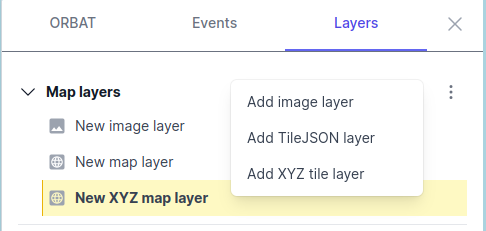

# Work with map background layers

ORBAT Mapper supports these background layer sources:

Raster layers:

- [XYZ tiles](#xyz-tiles)
- [TileJSON](#tilejson)
- [Images](#images)

Vector layers:

- [KML/KMZ](#kml-kmz)

## XYZ tiles

XYZ map tiles divide a map into small square tiles in a grid. A web browser can load these tiles quickly. Each tile is
a small image of a small area of the map. The XYZ system makes the index and the retrieval of the tiles easy.

## TileJSON

[TileJSON](https://github.com/mapbox/tilejson-spec/tree/master/3.0.0) is a format that uses JSON. It gives a simple
description of a set of XYZ map tiles. TileJSON is better than XYZ tiles, because it usually also gives the
attribution, the available zoom levels and the extent.

## Images

An image layer is one image on top of the map at a specified location. You can turn it and change its size to make it
agree with the map.

## KML/KMZ

To add a KML or KMZ file as a temporary map layer, drag the file and drop it on the map. As an alternative, use the
[import data](import-data) dialog. If you select the "Extract KML styles" option, ORBAT Mapper tries to use the images
and the styles in the file.

The application keeps KML/KMZ layers in memory. Thus, do not add too many of them. Use them only as temporary reference
layers. You cannot save them as part of the scenario.
