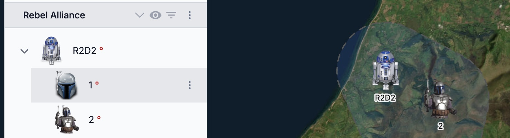

# Military symbology

For units, equipment and installations, ORBAT Mapper primarily uses the military map symbols of
[MIL-STD 2525D](https://www.jcs.mil/Portals/36/Documents/Doctrine/Other_Pubs/ms_2525d.pdf) and [NATO
APP-6D](https://nso.nato.int/nso/nsdd/main/standards/ap-details/1912/EN). The
[Milsymbol](https://spatialillusions.com/milsymbol/index.html) library draws the standard military symbols. It is an
excellent library.

    <DocMilSymbol sidc="10031000131211004600" /> 
    <DocMilSymbol sidc="10061000151205010000" />
    <DocMilSymbol sidc="10031500331105030000" />
    <DocMilSymbol sidc="10032000001213010000" />
    <DocMilSymbol sidc="10011000000000000000" />
    <DocMilSymbol sidc="10031000000000000000" />
    <DocMilSymbol sidc="10041000000000000000" />
    <DocMilSymbol sidc="10061000000000000000" />

At first, military symbols can look strange and unusual. But when you know the basic rules, you see that their
construction is logical. If you want to know more, start here:

- [Military Symbols Study Guide](https://mgrs-mapper.com/blog/military_symbols_fundamentals/)
- [NATO Joint Military Symbology wikipedia page](https://en.wikipedia.org/wiki/NATO_Joint_Military_Symbology)
- The standard documents [MIL-STD 2525D](https://www.jcs.mil/Portals/36/Documents/Doctrine/Other_Pubs/ms_2525d.pdf)
  and [NATO
  APP-6D](https://nso.nato.int/nso/nsdd/main/standards/ap-details/1912/EN)

## Symbol identification codes

MILSTD 2525D/APP-6D gives each symbol a unique symbol identification code (SIDC) of 20 digits. Usually you do not use
these codes directly. But it is very useful to know their construction. To examine symbol codes, use the
[Joint military symbology explorer](https://explorer.milsymb.net/#/explore/) or read the standards.

### Legacy symbol codes

Prior versions of the symbology standards use a shorter symbol identification code with letters. Many systems continue
to use these codes with letters. Thus, ORBAT Mapper can change codes with letters into codes with numbers. It uses the
[convert-symbology](https://github.com/orbat-mapper/convert-symbology) library. Almost all symbols of 2525C/APP-6C are
also in 2525D/APP-6D, but they can look different.

## Differences between MILSTD 2525D and APP-6D

ORBAT Mapper lets you select MILSTD 2525 or APP-6. There are some differences between the versions. The most important
difference is the dismounted individual symbol set. Only APP-6D has this symbol set:

    <DocMilSymbol sidc="10032700001101010039" />
    <DocMilSymbol sidc="10032700001102090001" />

## Custom unit symbols

If the standard military symbols are not sufficient, ORBAT Mapper also lets you make custom unit symbols. For more
data, see the [custom unit symbols guide](./custom-symbols.md).

