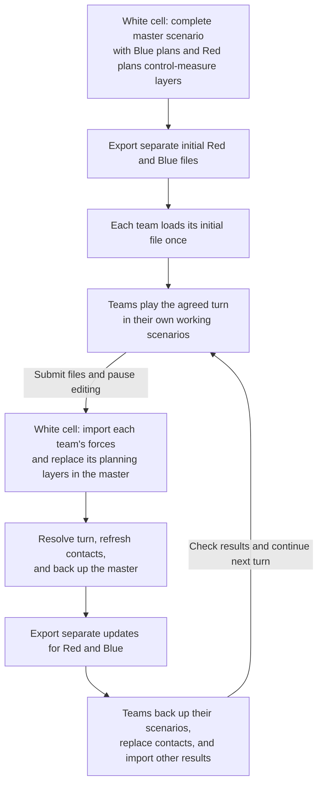

# Run a game with two teams and a white cell

This tutorial shows how to exchange scenario files during a turn-based game. The
white cell (the game controller) keeps a complete master scenario. Red and Blue
each receive their own forces and the information the white cell chooses to disclose
about their opponent. Both teams play over the same scenario-time interval.

You will prepare the master and export an initial file for each team. Each team
loads its file **once**, then keeps that working scenario throughout the game.
After each turn, white cell imports the teams' submissions into the master, resolves
the turn, and sends separate update files back. Teams **import** those updates into
their existing scenarios before continuing.

The exchange uses ORBAT Mapper `.json` files. Changes do not synchronize automatically.
White cell remains responsible for the complete master and for deciding what each
team receives.

Only the initial team files are loaded as new scenarios. Later white-cell files are
imported into the teams' existing scenarios. White cell excludes returned enemy
contact groups when importing team submissions.

## 1. Prepare the master

Start with a small practice scenario: two units per team, including one reserve
that has not yet been placed on the map. Keep reserves in the existing ORBAT so
their first deployment updates an existing unit.

Organize the units into separate groups. For example:

| Side | Group                 | Who edits it?                           | Who receives it? |
| ---- | --------------------- | --------------------------------------- | ---------------- |
| Blue | Blue forces           | Blue, then white cell during resolution | Blue             |
| Red  | Red forces            | Red, then white cell during resolution  | Red              |
| Red  | Red contacts for Blue | White cell                              | Blue             |
| Blue | Blue contacts for Red | White cell                              | Red              |

Contact groups contain reports about the opponent, not the opponent's actual units.
For example, **Red contacts for Blue** might contain a reported Red infantry unit
at its last-known location. White cell maintains that report separately from the
actual Red unit. These groups are an organizational convention, not access controls.

To build a recognized picture from an existing ORBAT and its recorded situation,
white cell can instead [duplicate a side with state](#create-a-recognized-picture-with-duplicate-side).
That approach keeps the recipient's picture on a separate side, with a distinct
icon color.

In the original master, create a **Blue plans** control-measure layer and a
**Red plans** control-measure layer before exporting any team files. These are the
layers each team will use for its plans, even if they start empty. Also create a
**Shared boundaries** control-measure layer for boundaries maintained by white cell.

Export Blue plans to Blue and Red plans to Red. Teams edit their supplied planning
layer instead of creating a replacement layer each turn. This preserves the layer
IDs that white cell uses to replace the matching layers in the master.

Agree on the turn interval, such as 08:00–10:00 on the scenario's first day, and use
the same date, time zone, and end time for both teams. Keep the complete master with
white cell from the start.

Use **File → Download scenario** to keep a file backup. Rename it, for example,
`Exercise-master-turn-00.json`. **Save scenario** and downloading a file are different
operations; keep downloaded backups throughout the game. See [Load and save](../storage.md).

::: warning Check contact information before sharing
Create contact reports with only the information the receiving team should know.
If you copy an actual unit to make a contact, inspect the copy's details and history:
it may carry equipment, notes, previous positions, or future orders that should not
be disclosed. Contact copies do not automatically follow the actual unit.
:::

## 2. Export the first team files

In the master scenario:

1. Open **File → Export scenario data…** and select **ORBAT Mapper**.
2. Select the groups and layers for Blue using the table below.
3. Check the suggested scenario name and filename. Add the turn and purpose, for
   example `Exercise — Blue — Turn 1` and `Exercise-Blue-turn-01-start.json`.
4. Expand **Export presets** and save the selection as **Blue starting scenario**.
5. Click **Preview recipient data**. Inspect the included groups, layers, and
   scenario-wide information, then export the file.
6. Repeat for Red, saving a **Red starting scenario** preset and exporting
   `Exercise-Red-turn-01-start.json`.

Names follow your selections until you edit the corresponding field. Names loaded
from presets are preserved, so update the turn number yourself when reusing a preset.
Presets are saved in this browser for this scenario; they do not travel with the files.

| Recipient | Groups to select                   | Layers to select              |
| --------- | ---------------------------------- | ----------------------------- |
| Blue      | Blue forces; Red contacts for Blue | Shared boundaries; Blue plans |
| Red       | Red forces; Blue contacts for Red  | Shared boundaries; Red plans  |

Export selection operates on whole groups. To disclose only selected enemy units,
put their contact reports in the appropriate contact group instead of selecting
the opponent's actual force group.

::: warning Partial export is not automatic fog of war
Uncheck groups and layers the recipient must not receive. Hiding an item on the map
does not remove it from the file. Partial export retains other scenario-level data,
so also review scenario descriptions, events, and other shared information. Keep
controller-only briefing material outside the exchanged scenarios.
:::

Open each exported file as a separate scenario and inspect its ORBAT, layers, unit
details, and timeline before sending it. Return to the master when you finish checking.
Send each team its file together with the turn's start and end time.

## 3. Teams play and submit their files

Each team uses **File → Load scenario…** to load its starting file **once**.
Save it as the team’s working scenario and keep using it in later turns.

For the practice turn, ask Blue to move one unit and place its existing reserve on
the map at the appropriate scenario time. Ask Red to move one unit. Both teams
should also add or change a control measure on their supplied planning layer.

Give teams these instructions:

- Edit your own force group and planning layer. Leave shared layers and enemy contacts
  under white-cell control.
- Deploy reserves by placing the existing ORBAT unit, rather than recreating it.
- Use the agreed scenario times for changes.
- When finished, use **File → Download scenario**. Rename the downloaded file to
  `Exercise-Blue-turn-01-submission.json` or `Exercise-Red-turn-01-submission.json`.
- Send the file with a short note about changes requiring a ruling, then wait for
  white-cell updates before continuing play. Keep the existing working scenario.

The submission can contain the whole team scenario, including contacts. White cell
will choose only the team's own contribution during import.

## 4. Import each team's units into the master

Open the master and download a backup named `Exercise-master-turn-01-before-import.json`.

To import Blue's submission:

1. Open **File → Import data…**, select Blue's submission, and load it.
2. Choose **Group** as the import type.
3. Select **Blue forces** in the group selector above the unit table. Check the
   selection: the first available group is selected automatically.
4. Choose **Update included units** and **Units with state**. Set **State history**
   to **Replace state history** so corrections to existing history entries are included.
5. Select the units to import using the table checkboxes. Expand rows to inspect
   subordinate units.
6. Read the **Changes** column and the summary below the table. Expand **Review changes**
   to check positions, parent changes, and history changes. **Show changed entries only**
   helps you find changes, but does not change which units are selected.
7. Confirm that the target is Blue's force group, then click **Import**.

Repeat for **Red forces** using Red's submission. If a team owns several groups,
import each group separately. Do not import the returned enemy contact groups.

**Update included units** preserves units omitted from the submission. Matching uses
unit IDs, not names, so the deployed reserve should appear as an update to an existing
unit, not as an added unit. If it appears as an addition, stop and check whether the
team recreated the unit or used a different starting file.

This action replaces the included units' authored fields with their incoming values;
it does not resolve competing edits field by field. Make white-cell adjustments after
importing the submissions. Missing parents or references outside the selected scope
can block an import; resolve the scope or source data rather than making a separate
copy to bypass the problem.

::: tip Use replacement only for a complete contribution
**Replace entire side/group** can remove units missing from the incoming file.
Use it only when you intend to replace that complete scope and have checked the removal
list. **Import as a separate copy** is for intentional duplication, not routine turn updates.
:::

After each import, check the result at the relevant scenario time. If it is wrong,
use **Undo** immediately to revert that import in one step. The downloaded backup is
your fallback if you need to return to the start of the import session later.

## 5. Import the planning layers

Unit import does not also import the team's control-measure planning layer. Load the same submission
through **File → Import data…** again and choose **Layers**.

1. Select only **Blue plans** for Blue's submission.
2. For the matching layer created in the original master, choose **Replace existing layer**.
   Matching uses the layer ID; the default copy option would create another layer.
3. Inspect the replacement preview. Expand it to see added, changed, and removed items.
4. Click **Import**, then inspect the map.
5. Repeat for **Red plans** from Red's submission.

Replacement keeps the layer's position in the layer stack and replaces its properties
and contents, including lock state and history. Items missing from the submission
are removed. If the submission has an empty planning layer, replacement clears its contents.

Do not reimport unchanged shared boundaries or white-cell layers. If no matching
layer is offered, check whether the team created a new layer instead of editing the
supplied one. A matching name alone does not make it a replacement.

Use **Undo** immediately after an incorrect layer import to restore the previous
version in one step. Unit and layer imports are separate operations with separate undo steps.

## 6. Resolve the turn and export updates

With both submissions in the master, white cell makes its rulings. Update the actual
units as needed, then revise each team's contact reports to reflect what that team
now knows. Decide whether a contact represents a current observation or an older
last-known position, and make that clear in the report.

Check the master at the agreed end-of-turn time. Download it as
`Exercise-master-turn-01-resolved.json` and retain both original submissions.

Prepare **update files**, rather than new starting scenarios. For each recipient,
select its complete contact group and any own-force group or white-cell layers whose
contents must be returned after resolution. Exclude the opponent's actual forces and
the other team's contacts and plans.

| Update for | Always include | Include when changed by white cell |
| ---------- | -------------- | ---------------------------------- |
| Blue | Red contacts for Blue | Blue forces; Shared boundaries; Blue plans |
| Red | Blue contacts for Red | Red forces; Shared boundaries; Red plans |

Save **Blue contacts update** and **Red contacts update** export presets with only
the respective contact group selected and all layers unchecked. For turns with other
results, load the relevant preset and explicitly add the required force groups and
layers. Keep the contacts-only preset for later reuse, or save a separate preset for
the broader selection.

The contact group must contain **all contacts the team should retain**, including
unchanged reports. Teams will replace that group, so reports absent from it will be
removed. To withdraw every contact, export the **existing group with no units in it**.
Omitting the group does not clear contacts in the team's scenario. Edit the same
contact group across turns so its ID remains stable.

For changed white-cell overlay layers, send the complete layer. Include an empty
layer when its old contents should be cleared. Layer replacement removes omitted items.

Use **Preview recipient data** to inspect each update, including stored unit history
and scenario-wide information. Name the files, for example:

- `Exercise-Blue-turn-01-results.json`
- `Exercise-Red-turn-01-results.json`

Send each team its file with a short list of what to import, any explicit removals,
and the next turn's start and end time. A contacts-only update is enough **only if
white cell confirms that no other results need applying**. Changes to losses,
positions, status, or other unit data also require own-force updates; changed
white-cell overlays must be imported too.

## 7. Teams import results into their existing scenarios

Keep the team's current scenario open. Before importing, download a backup such as
`Exercise-Blue-turn-01-before-results.json`. Continue to pause editing until all
results have been applied.

Open **File → Import data…** and select the results file. Import each part listed by
white cell separately:

| Returned content | Import type | Action and content options |
| ---------------- | ----------- | -------------------------- |
| White-cell contact reports | **Group** | Select the contact group; choose **Replace entire side/group**, **Units with state**, and **Replace state history**. |
| Adjudicated own-force units | **Group** | Select your force group and the returned units; choose **Update included units**, **Units with state**, and **Replace state history**. |
| White-cell overlay layers | **Layers** | Select the returned layers and choose **Replace existing layer** for each match. |

Review the preview before every import. Contact-group replacement should remove only
withdrawn reports. It must not replace the team's own forces. Keep local planning
layers unselected unless white cell explicitly returns changes to them. Use **Undo**
immediately if an import applies the wrong changes.

For own-force updates, omitted units remain in the scenario. If white cell intends
to remove a unit entirely, agree on that removal explicitly; omission from a partial
update does not delete it. Whole-force-group replacement is appropriate only when
white cell supplies that complete group and the team intends to replace it.

Check the result at the agreed turn boundary, save the working scenario, and continue
playing in it. This preserves planning material outside the imported scope. Incoming
unit fields and history can still overwrite local edits to included units, which is
why teams pause between submission and receiving results.

## 8. Practice a second turn

Repeat the cycle before using it in a game. Include these checks:

- Move an existing unit and deploy a reserve. White cell's import should update them
  without creating duplicates.
- Update one contact, withdraw another, and retain an unchanged contact. Replacing
  the team's contact group should produce exactly that set.
- Send an empty contact group and verify that it clears all previous reports.
- Return an adjudicated own-force change and verify that the team applies it while
  its other units and local planning layers remain intact.
- Change and remove planning control measures. White cell's layer replacement should keep
  one layer and remove the deleted feature.
- Confirm that both teams continue in their existing scenarios and use the same
  next-turn interval.

For other import modes, including state-only updates and history append behavior,
see [Import ORBAT Mapper scenarios](../import-data.md#orbat-mapper-scenarios).

## Option: organize contributions as separate sides

The examples use groups to separate real forces from contact reports. You can instead
use separate sides for **Blue forces**, **Red forces**, **Red contacts for Blue**, and
**Blue contacts for Red**, with units attached directly to each side. Set each side's
standard identity to match the forces it represents.

For a side without groups, use **Include side** during export and **Side** during
import. Apply the same rules: update own-force units, replace the complete contact
side, preserve IDs, and preview the changes. Keep real forces and contact reports
in separate import scopes so replacing contacts cannot remove actual units.

Avoid mixing private root units with contact groups on the same side: selecting a
group also retains that side's directly attached units in the export. Inspect the
recipient preview whenever you change the organization.

### Create a recognized picture with Duplicate side

Use **Duplicate (with state)** as a starting point for the recognized picture—the
situation white cell wants a particular team to receive. For example, create Blue's
picture of Red from the actual Red side:

1. In the master, open Red's side menu and choose **Duplicate (with state)**. This
   copies the side's units and their stored state, including units attached directly
   to the side and units in groups.
2. Edit the copied side and rename it **Red picture for Blue**. Keep the Red standard
   identity, but choose a different **Fill color** for its icons so white cell can
   distinguish the recognized picture from the actual Red forces. Check the resulting
   symbols: group or unit color overrides may also need adjusting.
3. Set the agreed scenario time and edit the copied units to represent what Blue
   knows: reported positions, identity, strength, and other disclosed information.
4. For a unit Blue may know exists but should not see positioned on the map, select
   **Remove from map** in that copied unit's state controls. Check the picture at the
   turn boundary and across the time interval the team will use.
5. If Blue must not know about a unit at all, **delete it from the picture side**.
   Inspect its subordinate units too. Keep the actual unit on the original Red side.
6. Review the copied details and state history. Remove or revise undisclosed past
   positions, future orders, equipment, and notes before distributing the picture.
7. Export **Red picture for Blue** with Blue's own forces and the appropriate layers
   for the initial file. Save a separate contacts-update preset containing only the
   picture side's content for subsequent turns. Use **Preview recipient data** to
   inspect exactly what Blue will receive.

Repeat for **Blue picture for Red**, using a distinct icon color for that picture.
These picture sides take the place of the contact groups in the earlier examples.
For a side without groups, select **Include side**; for a side with groups, select
all groups belonging to that recipient's picture. Never include the actual opposing
force side in the recipient's export.

::: warning Removing a map symbol does not remove its information
**Remove from map** leaves the unit in the ORBAT and does not erase its stored history.
A different icon color also provides no access restriction. If information must not
reach the recipient, remove it from the picture being exported and verify the file's
contents in the recipient preview.
:::

Create each picture side once, then maintain it across turns. Repeated duplication
creates new IDs and is unsuitable for the regular replacement workflow. Picture
copies do not automatically follow the original units: white cell updates the
recognized situation after resolving each turn.

Teams import the returned picture using **Side → Replace entire side/group**,
**Units with state**, and **Replace state history**. Select the picture side, review
its removals, and leave actual forces outside the replacement scope. Include the
complete picture each time, including unchanged contacts. If every contact is
withdrawn, return the existing picture side with no units so replacement can clear it.

## Alternative: distribute fresh starting scenarios

If the teams later choose to reset their working scenarios each turn, white cell can
export complete recipient files after resolution using the starting-scenario presets.
Include the team's own forces, disclosed contacts, and the required shared and
planning layers. Teams back up their previous scenario and **load** the new file
instead of importing results. Include any planning material they need to carry forward.
