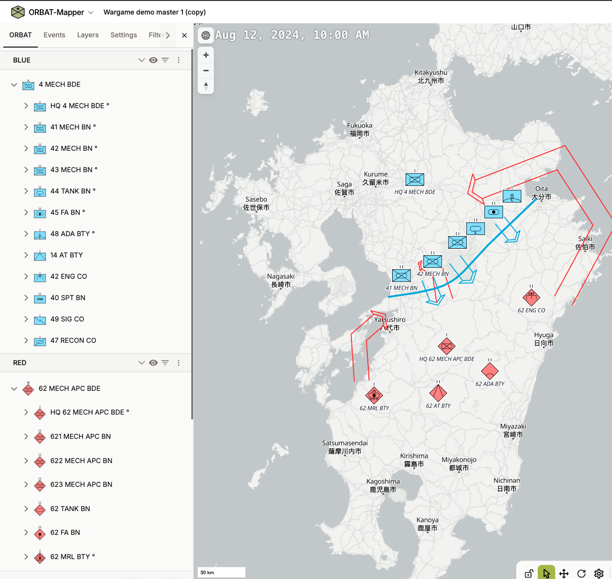
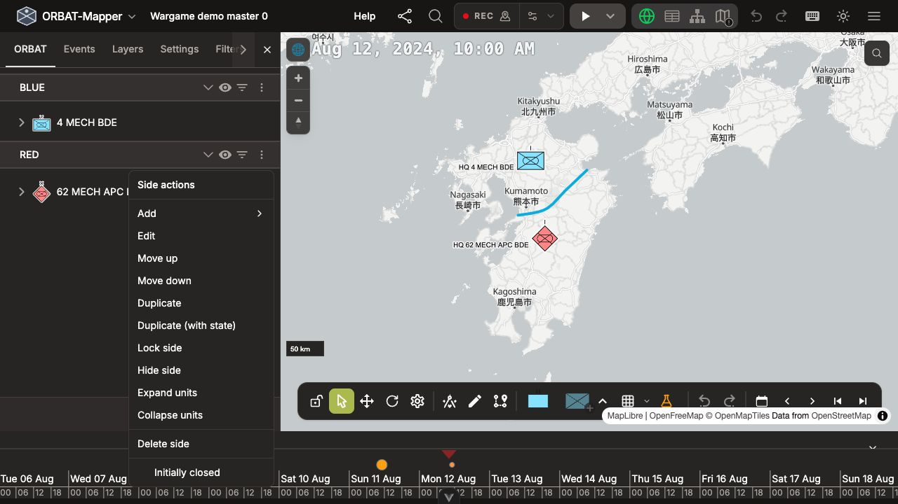
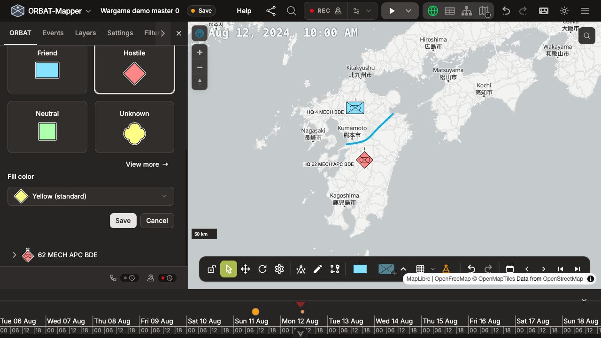
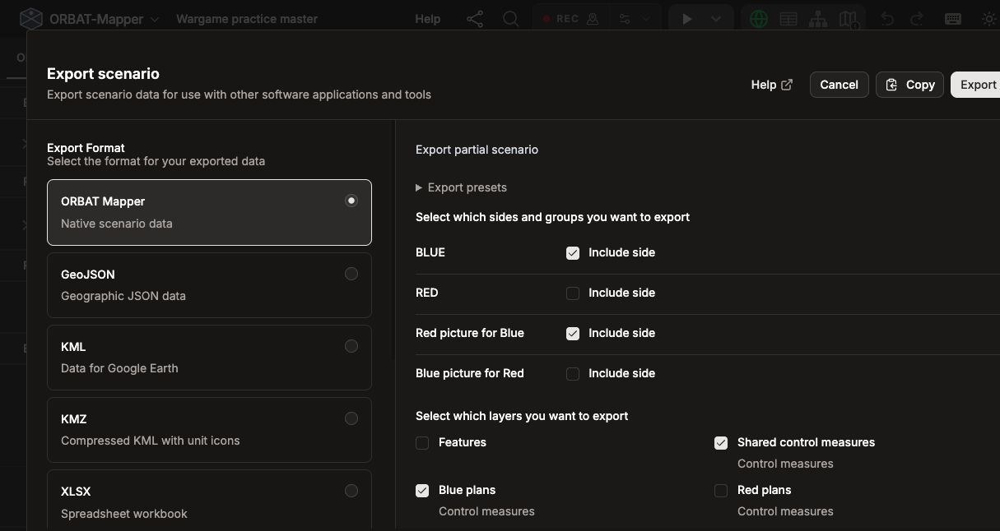
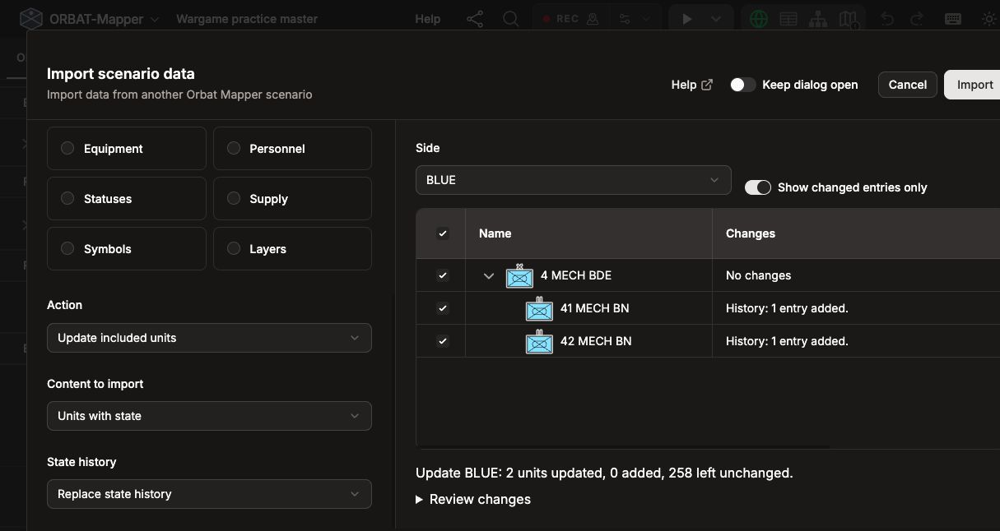

# Run a two-team wargame

A wargame lets participants explore a situation by making decisions, considering
an opponent's actions, and discussing the consequences. ORBAT Mapper can support
this with a map, forces, plans, and a timeline. The **white cell** (game master or
controller) manages the full situation and decides the results.

This tutorial walks through one practice turn with Blue, Red, and a white cell.
Each team works in its own scenario and exchanges files with white cell. There is
no automatic synchronization or combat resolution: white cell reviews the plans,
makes a ruling, and sends each team the information it should receive.

You should already know the basics of [editing units on the map](../map-edit-mode.md)
and [using the timeline](../map-edit-mode.md#timeline). The exercise is about the
workflow; use any convenient positions and simple movements. Click a screenshot
to view it at full size.

_An example with more units deployed and plans drawn. The downloadable master 0
is the starting point; this tutorial uses just two active units per side._

## 1. White cell: prepare the master

Download [Wargame demo master 0](/scenarios/wargame-demo-master-0.json) and open it
with **File → Load scenario…**. This example contains Blue and Red ORBATs, two
positioned headquarters, and a border on **Shared control measures**. Keep this
complete scenario as the white-cell master.

1. Set the scenario time to **12 August 2024, 10:00 UTC**. Agree that the practice
   turn ends at **11:00 UTC**.
2. Place Blue's **41 MECH BN** and **42 MECH BN**, and Red's **621 MECH APC BN**
   and **622 MECH APC BN**, near the border. Only these four units will take part;
   leave the remaining ORBAT in place.
3. Create two control-measure layers: **Blue plans** and **Red plans**. Players
   will draw on these supplied layers. Keep **Shared control measures** for the
   border and other information maintained by white cell.

Create the planning layers in the master before exporting team files. This lets
white cell import each team's plans back into the matching layer later.

### Prepare what each team knows

Each team receives its own actual forces and a separate **opponent picture**:
white cell's representation of what that team knows about the enemy.

1. Open the **RED** side menu and choose **Duplicate (with state)**.
2. Rename the copy **Red picture for Blue**. Edit the side's **Fill color** so its
   symbols look different from the actual Red forces. Keep its Red standard identity.
3. In the copy, choose one active Red unit as a reported contact and move it
   directly under the picture side before deleting its former parent. Delete
   other units Blue should not know about, including undisclosed subordinates of
   the retained unit. Adjust its position and details to represent Blue's initial report.
4. Repeat with **BLUE**, naming its copy **Blue picture for Red** and giving it
   another distinguishable color. Keep one active Blue unit as Red's initial contact.

_Duplicate the actual side with its recorded state to start an opponent picture._

_Keep the side’s standard identity and choose a different Fill color for the picture._

The master now has four sides: two actual forces and two opponent pictures.
Create the pictures once and edit those same copies after each turn; they do not
automatically follow the actual units.

::: warning Check the information you share
Different colors and hidden symbols do not restrict access to information.
**Remove from map** leaves the unit in the ORBAT. Delete units the recipient must
not know about, and inspect copied details and history for undisclosed positions,
orders, equipment, or notes. Check symbol colors too if units override the side color.
:::

Use **File → Download scenario** to save a backup such as
`Wargame-master-turn-00.json`. Downloading a backup is separate from saving in the
browser; see [Load and save](../storage.md).

## 2. White cell: send the starting files

Open **File → Export scenario data…** and select **ORBAT Mapper**. The demo's
units are attached directly to sides, so use **Include side** for each selected side.
Export one file per team:

| Team | Sides to include           | Layers to include                   |
| ---- | -------------------------- | ----------------------------------- |
| Blue | BLUE; Red picture for Blue | Shared control measures; Blue plans |
| Red  | RED; Blue picture for Red  | Shared control measures; Red plans  |

_Blue receives its actual forces, its picture of Red, and the two selected layers._

Uncheck all other sides and layers. Click **Preview recipient data** and check
that the opponent's actual forces and private planning layer are absent. Also
review scenario-wide descriptions and events, which partial export retains.
Keep controller-only briefing material outside the exchanged scenarios.

Name the files `Wargame-Blue-turn-01-start.json` and
`Wargame-Red-turn-01-start.json`. Save the selections under **Export presets** as
**Blue team** and **Red team** to reuse after resolution. Presets stay in this
browser for this scenario; update filenames yourself when reusing them.

Open each exported file separately to check the recipient's view, then return to
the master. Send each team its file and the **10:00–11:00 UTC** turn interval.

## 3. Players: plan, move, and submit

Blue and Red each follow these steps:

1. Load your starting file using **File → Load scenario…**.
2. Review your own forces, the border, and the supplied opponent picture.
3. Draw one planning arrow on your team's planning layer. Blue practices an
   advance toward the border; Red repositions to observe it.
4. Set the scenario time to **11:00 UTC** and move your two active units to their
   proposed end-of-turn positions, with unit position recording enabled. These
   movements are proposals for white cell to review.
5. Choose **File → Download scenario**. Name the file
   `Wargame-Blue-turn-01-submission.json` or `Wargame-Red-turn-01-submission.json`.
6. Send it to white cell with a short note explaining your intent. Pause editing
   until the results arrive.

Edit only your actual forces and supplied planning layer. Leave the opponent
picture and shared control measures under white-cell control. Submit the whole
team scenario; white cell will select the parts to import.

## 4. White cell: combine the submissions

Open the master and download a backup before importing. For Blue's submission:

1. Open **File → Import data…**, select the submission, and load it.
2. Choose **Side** and select **BLUE**, the actual force side.
3. Choose **Update included units**, **Units with state**, and
   **Replace state history**. Select the units to import and review the changes.
   The moved units should update existing units, not create copies.
4. Click **Import** and check the result at **11:00 UTC**.
5. Load the same submission through **File → Import data…** again, this time
   choosing **Layers**. Select only **Blue plans**, choose **Replace existing layer**,
   review the preview, and import.

_The preview shows two existing Blue units updated and no units added.
Show changed entries only filters the preview without changing the selection._

Repeat for **RED** and **Red plans** using Red's submission. Do not import the
returned opponent pictures or unchanged shared layers.

Units and layers are separate imports. Keep the original units and supplied
layers throughout the game so their IDs continue to match. If an import looks
wrong, use **Undo** immediately. For import settings and troubleshooting, see
the [file exchange reference](./file-exchange.md).

## 5. White cell: resolve the turn and return results

Review both teams' proposed movements and arrows. For this practice turn:

1. Adjust one actual unit's end position to demonstrate a white-cell ruling—for
   example, its movement took longer than planned. Explain the ruling in the results.
2. Update a contact in each opponent-picture side to represent a new sighting at
   **11:00 UTC**. Edit the existing picture units, keeping their IDs. Make clear
   whether each report is current or a last-known position.
3. Check the master at the turn boundary and download
   `Wargame-master-turn-01-resolved.json`.

Export complete team files using the **Blue team** and **Red team** selections
from step 2. Include each team's actual forces, complete opponent picture, shared
control measures, and its planning layer—including the plans just imported.
Preview each recipient's data again before sharing.

Name these files `Wargame-Blue-turn-01-results.json` and
`Wargame-Red-turn-01-results.json`. Send each team its file, a short explanation of
the results, and the next turn interval, **11:00–12:00 UTC**. List which layers you
changed so players who keep their existing scenarios know what to import.

## 6. Players: receive the results

The simplest option is to download a backup of your current scenario, then use
**File → Load scenario…** to open the results as your next working scenario.
Check your forces, opponent picture, and planning layer at **11:00 UTC**, read
white cell's explanation, and begin the next turn when instructed.

### Update your existing scenario instead

To keep your current working scenario, download a backup and use
**File → Import data…** with the results file. Import each part separately:

| Content                            | Import settings                                                                                                            |
| ---------------------------------- | -------------------------------------------------------------------------------------------------------------------------- |
| Your opponent picture              | **Side** → select the picture side → **Replace entire side/group**, **Units with state**, **Replace state history**.       |
| Your actual forces                 | **Side** → select BLUE or RED as appropriate → **Update included units**, **Units with state**, **Replace state history**. |
| Returned shared or planning layers | **Layers** → select the layers white cell changed → **Replace existing layer** for each.                                   |

Review each preview before importing. Replace the complete opponent picture so
withdrawn contacts disappear; keep your actual forces outside that replacement.
Own-force updates preserve omitted units, so any intended unit deletion must be
communicated explicitly. Leave unchanged layers unselected.

Check the result at **11:00 UTC** before resuming play. For complete replacement,
empty pictures, and other exchange options, see the
[file exchange reference](./file-exchange.md).

The next turn repeats the same cycle: teams submit, white cell imports and resolves,
and teams receive their updated situations. Keep each turn's master backup and submissions.
