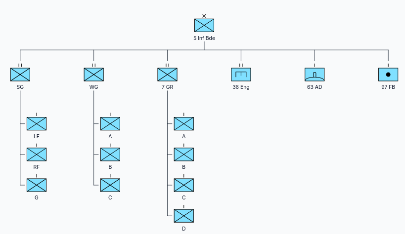
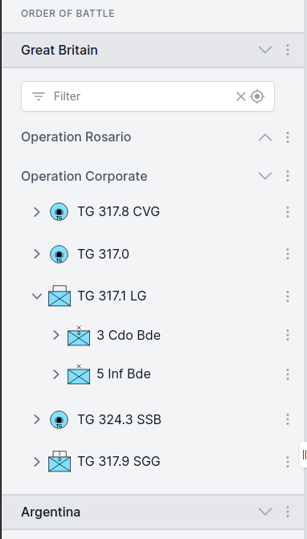

# Terminology

Internally, ORBAT Mapper uses a data model that is related to the
[Military Scenario Definition Language (MSDL)](https://en.wikipedia.org/wiki/Military_Scenario_Definition_Language).
This section gives the terminology that you find when you build a scenario.

## Sides and groups

A scenario has _units_. The units are in _sides_ and _groups_. Usually a side is a nation or a coalition. In a WWII
scenario the sides are usually _Allied forces_ and _Axis forces_.

For each side you can specify a standard identity (affiliation). The standard identity controls the color and the shape
of the unit icons. Friend, neutral and hostile are the most usual identities:

    <DocMilSymbol sidc="10031000000000000000" />
    <DocMilSymbol sidc="10041000000000000000" />
    <DocMilSymbol sidc="10061000000000000000" />
    
Friend

    
Neutral

    
Hostile

You can also select custom colors. Custom colors are useful when you do not want to show a side as hostile. They are
also useful when you want to identify different nations by the color of the symbol.

    <DocMilSymbol sidc="10031000000000000000" :modifiers="{fillColor: '#aab074'}"/>
    <DocMilSymbol sidc="10031000000000000000" :modifiers="{fillColor: '#ffd00b'}"/>
    <DocMilSymbol sidc="10031000000000000000" :modifiers="{fillColor: '#ff3333'}"/>

Each side has one or more groups of units. A group is only a method to organize your units. For example, a group can be
a branch (army, navy, air force, etc.), a task force or a battlefront. You can also use no groups and put the units
directly below a side.

A side or a group has one or more unit hierarchies. The unit at the top of a hierarchy is the _root unit_.

## Units

A unit is the basic element of a scenario. Usually a unit is a military unit, for example a platoon, a company or a
battalion. But a unit can also be infrastructure, equipment, a vehicle, etc.

    <DocMilSymbol sidc="10031000161211000000" />
    <DocMilSymbol sidc="10031000141205000000" />
    <DocMilSymbol sidc="10061000151301020000" />

The units are in a hierarchy with a tree structure:

Each unit has a set of attributes. These attributes are the most usual:

- _name_
- _symbol/icon_
- _location_

You can give more attributes to a unit. These are examples:

- _description_
- _image_
- _url_
- _symbol modifiers_
- _average speed_
- _maximum speed_

### Unit state

In ORBAT Mapper, the state of a unit is the set of current values of its attributes. These values can change in time.
For example, the location of a unit changes as the unit moves. Its symbol can change if the unit becomes damaged or
destroyed. ORBAT Mapper is not a simulation tool. But it can record the changes of some unit attributes as the scenario
continues.

### Table of Organization and Equipment (TO&E)

A military unit has personnel and equipment. Usually this composition is the [Table of Organization
and Equipment (TO&E)](https://en.wikipedia.org/wiki/Table_of_organization_and_equipment). The TO&E gives the structure,
the roles and the responsibilities of the personnel of the unit. It also gives the types and the quantities of the
equipment.

ORBAT Mapper has basic support for TO&E data.

## Map layers and features

The map is an important part of a scenario. A scenario map has more than one layer. The application draws the _base
layer_ first. On the base layer you can add raster _map layers_, and then _feature layers_.

A raster map layer has one or more raster images. Usually raster map sources are aerial photos and scanned maps. A
feature layer has one or more _features_. A feature is a point, a line or a polygon with a style on the map.

[//]: # "## Events"
[//]: #
[//]: # "How you organize a scenario is up to you. One example is the Falklands demo scenario. It consists of two sides, Great"
[//]: # "Britain and Argentina."
[//]: #
[//]: # ""
