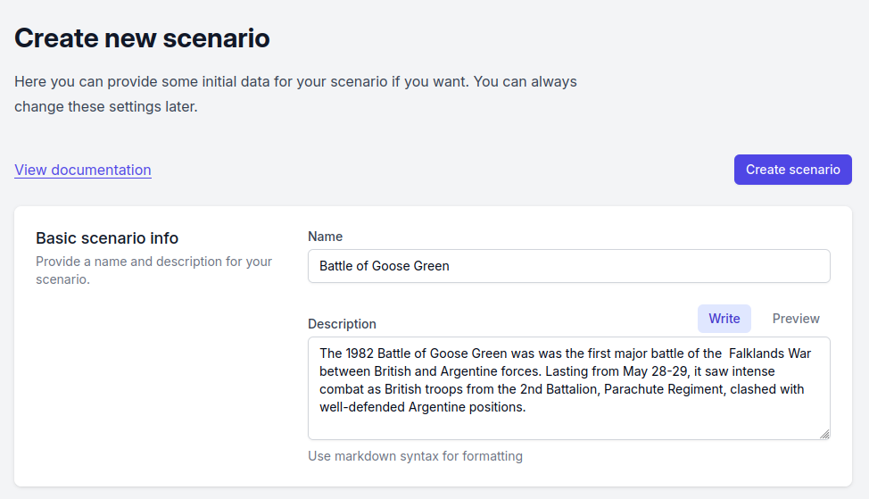
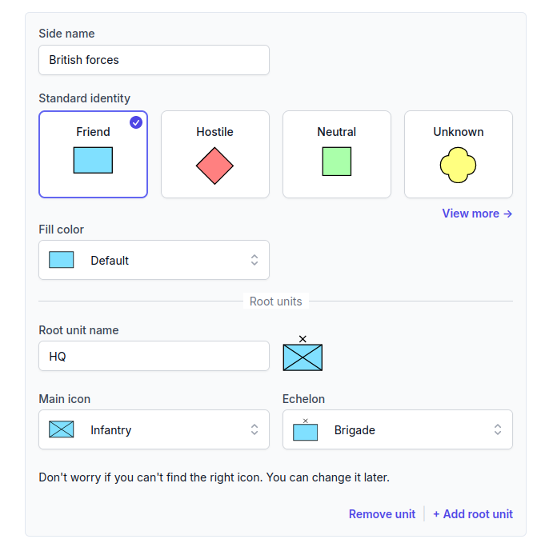
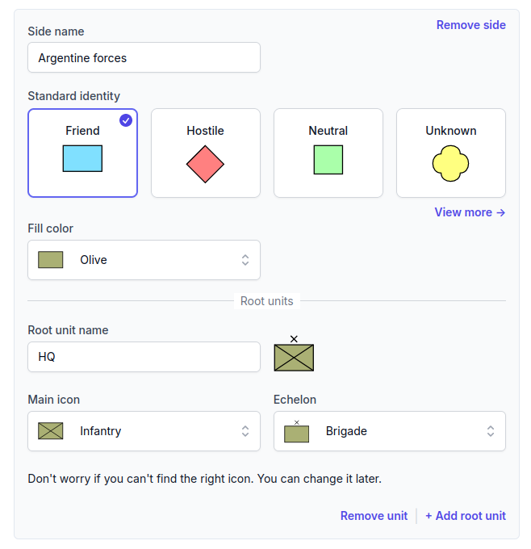
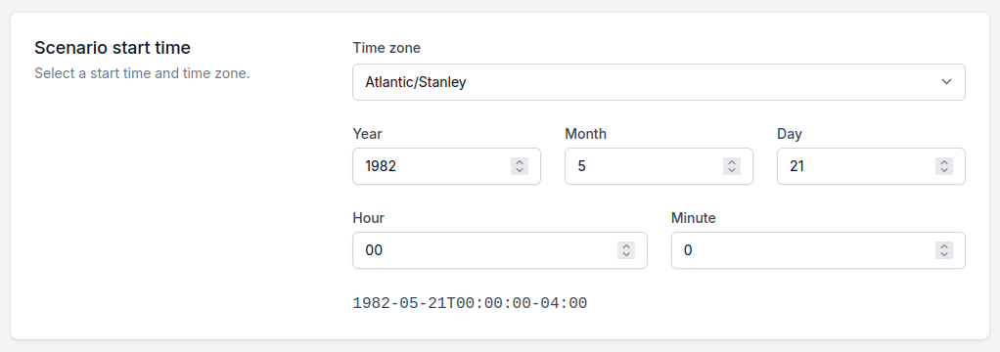

# Getting started

First, select the _Create new scenario_ option on the start page. A form opens. In this form you can give the basic
scenario data and an initial ORBAT.

## Create a new scenario

First, add a name and a description:

### Initial ORBAT

Then you can add an initial ORBAT. For this scenario we make two sides: _British forces_ and _Argentine forces_. We
will change the root units later. Thus, keep the default root units now.

The standard identity controls the color and the shape of the unit icons. You do not have to use the standard fill
colors. For this scenario we use the _Olive_ fill color for the Argentine forces with the _Friend_ standard identity
shape.

### Scenario start time

For this scenario we set the start time to 21 May 1982. On this day the
[British landings](https://en.wikipedia.org/wiki/Operation_Sutton) on the shores of San Carlos Water occurred. For the
time zone we use the local time zone of the Falkland Islands: Atlantic/Stanley (GMT-4).

::: info

The British forces used Greenwich Mean Time (GMT) in the Falklands War. If you prefer GMT/ZULU time, use it for your
scenario.
:::
