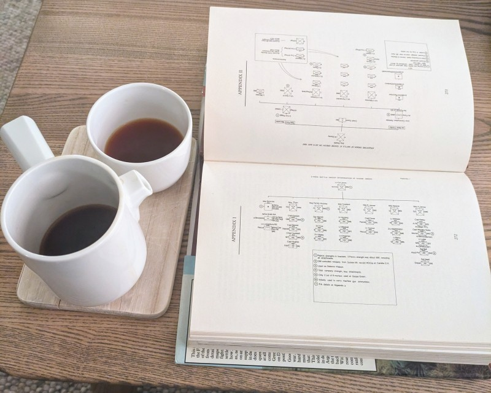

# Research

Usually, a historical scenario starts with much research. You must know the units, their operations, the times and the
locations. Get as many details as possible, because you must plot the movements of the units in time. If you want
accuracy and details, it can be very difficult to find sufficient data. Usually you must examine many books, documents
and websites.

_Research :heart:_

## Sources

Many documents about the Falklands War are available, and much of the data is online. Wikipedia has a long entry about
the [Battle of Goose Green](https://en.wikipedia.org/wiki/Battle_of_Goose_Green). But to get sufficient details, you
can also read some of the books in the
[sources section](https://en.wikipedia.org/wiki/Battle_of_Goose_Green#Sources). These two books are very good:

- Adkin, Mark (1992). _Goose Green – A battle is Fought to be Won_. London: Pen & Sword Books Ltd. ISBN
  978-0-85052-207-5.
- Fitz-Gibbon, Spencer (2002). _Not Mentioned in Despatches: The History and Mythology of the Battle of Goose Green_.
  Lutterworth Press. ISBN 0-7188-3016-4.

::: tip
Many libraries let you borrow and read books online. [The Internet archive](https://archive.org/) also has books. It
includes
[some books about the Battle of Goose Green](https://archive.org/search?query=title%3A%28goose%20green%29).
:::
