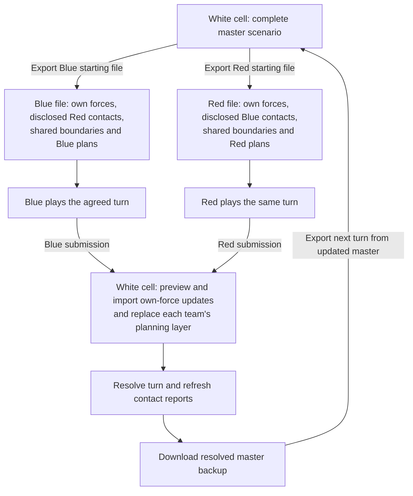
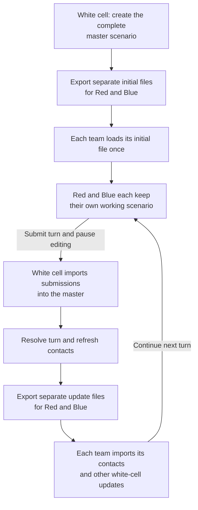

# Run a game with two teams and a white cell

This tutorial shows how to exchange scenario files during a turn-based game. The
white cell (the game controller) keeps a complete master scenario. Red and Blue
each receive their own forces and the information the white cell chooses to disclose
about their opponent. Both teams play over the same scenario-time interval.

You will prepare the master, export team files, import the teams' submissions,
resolve a turn, and send out the next files. The exchange uses ORBAT Mapper `.json`
files. Each file is a separate working scenario; changes do not synchronize automatically.

White cell excludes returned enemy contact groups from imports. In this workflow,
teams load each new starting file before playing the next turn. To keep an existing
team scenario instead, follow the [alternative import workflow](#alternative-keep-team-scenarios-and-import-white-cell-updates).

## 1. Prepare the master

Start with a small practice scenario: two units per team, including one reserve
that has not yet been placed on the map. Keep reserves in the existing ORBAT so
their first deployment updates an existing unit.

Organize the units into separate groups. For example:

| Side | Group                 | Who edits it?                           | Who receives it? |
| ---- | --------------------- | --------------------------------------- | ---------------- |
| Blue | Blue forces           | Blue, then white cell during resolution | Blue             |
| Red  | Red forces            | Red, then white cell during resolution  | Red              |
| Red  | Red contacts for Blue | White cell                              | Blue             |
| Blue | Blue contacts for Red | White cell                              | Red              |

Contact groups contain reports about the opponent, not the opponent's actual units.
For example, **Red contacts for Blue** might contain a reported Red infantry unit
at its last-known location. White cell maintains that report separately from the
actual Red unit. These groups are an organizational convention, not access controls.

Create separate map layers for **Shared boundaries**, **Blue plans**, and **Red plans**.
White cell maintains shared boundaries; each team edits its own planning layer.

Agree on the turn interval, such as 08:00–10:00 on the scenario's first day, and use
the same date, time zone, and end time for both teams. Keep the complete master with
white cell from the start.

Use **File → Download scenario** to keep a file backup. Rename it, for example,
`Exercise-master-turn-00.json`. **Save scenario** and downloading a file are different
operations; keep downloaded backups throughout the game. See [Load and save](../guide/storage.md).

::: warning Check contact information before sharing
Create contact reports with only the information the receiving team should know.
If you copy an actual unit to make a contact, inspect the copy's details and history:
it may carry equipment, notes, previous positions, or future orders that should not
be disclosed. Contact copies do not automatically follow the actual unit.
:::

## 2. Export the first team files

In the master scenario:

1. Open **File → Export scenario data…**.
2. Select the **ORBAT Mapper** export format.
3. Select the side groups and layers for Blue using the table below.
4. Set the scenario name to something recognizable, such as `Exercise — Blue — Turn 1`.
5. Set the downloaded filename to `Exercise-Blue-turn-01-start.json` and export it.
6. Repeat for Red, checking the selections again and using `Exercise-Red-turn-01-start.json`.

| Recipient | Groups to select                   | Layers to select              |
| --------- | ---------------------------------- | ----------------------------- |
| Blue      | Blue forces; Red contacts for Blue | Shared boundaries; Blue plans |
| Red       | Red forces; Blue contacts for Red  | Shared boundaries; Red plans  |

Export selection operates on whole groups. To disclose only selected enemy units,
put their contact reports in the appropriate contact group instead of selecting
the opponent's actual force group.

::: warning Partial export is not automatic fog of war
Uncheck groups and layers the recipient must not receive. Hiding an item on the map
does not remove it from the file. Partial export retains other scenario-level data,
so also review scenario descriptions, events, and other shared information. Keep
controller-only briefing material outside the exchanged scenarios.
:::

Open each exported file as a separate scenario and inspect its ORBAT, layers, unit
details, and timeline before sending it. Return to the master when you finish checking.
Send each team its file together with the turn's start and end time.

## 3. Teams play and submit their files

Each team uses **File → Load scenario…** to load its starting file.

For the practice turn, ask Blue to move one unit and place its existing reserve on
the map at the appropriate scenario time. Ask Red to move one unit. Both teams
should also change something on their planning layer.

Give teams these instructions:

- Edit your own force group and planning layer. Leave shared layers and enemy contacts
  under white-cell control.
- Deploy reserves by placing the existing ORBAT unit, rather than recreating it.
- Use the agreed scenario times for changes.
- When finished, use **File → Download scenario**. Rename the downloaded file to
  `Exercise-Blue-turn-01-submission.json` or `Exercise-Red-turn-01-submission.json`.
- Send the file with a short note about changes requiring a ruling, then wait for
  the next starting file before continuing play.

The submission can contain the whole team scenario, including contacts. White cell
will choose only the team's own contribution during import.

## 4. Import each team's units into the master

Open the master and download a backup named `Exercise-master-turn-01-before-import.json`.

To import Blue's submission:

1. Open **File → Import data…**, select Blue's submission, and load it.
2. Choose **Group** as the import type.
3. Select **Blue forces** in the group selector above the unit table. Check the
   selection: the first available group is selected automatically.
4. Choose **Update included units** and **Units with state**. Set **State history**
   to **Replace state history** so corrections to existing history entries are included.
5. Select the units to import using the table checkboxes. Expand rows to inspect
   subordinate units.
6. Read the **Changes** column and the summary below the table. Expand **Review changes**
   to check positions, parent changes, and history changes. **Show changed entries only**
   helps you find changes, but does not change which units are selected.
7. Confirm that the target is Blue's force group, then click **Import**.

Repeat for **Red forces** using Red's submission. If a team owns several groups,
import each group separately. Do not import the returned enemy contact groups.

**Update included units** preserves units omitted from the submission. Matching uses
unit IDs, not names, so the deployed reserve should appear as an update to an existing
unit, not as an added unit. If it appears as an addition, stop and check whether the
team recreated the unit or used a different starting file.

This action replaces the included units' authored fields with their incoming values;
it does not resolve competing edits field by field. Make white-cell adjustments after
importing the submissions. Missing parents or references outside the selected scope
can block an import; resolve the scope or source data rather than making a separate
copy to bypass the problem.

::: tip Use replacement only for a complete contribution
**Replace entire side/group** can remove units missing from the incoming file.
Use it only when you intend to replace that complete scope and have checked the removal
list. **Import as a separate copy** is for intentional duplication, not routine turn updates.
:::

After each import, check the result at the relevant scenario time. If it is wrong,
use **Undo** immediately to revert that import in one step. The downloaded backup is
your fallback if you need to return to the start of the import session later.

## 5. Import the planning layers

Unit import does not also import the team's planning layer. Load the same submission
through **File → Import data…** again and choose **Layers**.

1. Select only **Blue plans** for Blue's submission.
2. For the matching layer, choose **Replace existing layer**. Matching uses the layer
   ID; the default copy option would create another layer.
3. Inspect the replacement preview. Expand it to see added, changed, and removed items.
4. Click **Import**, then inspect the map.
5. Repeat for **Red plans** from Red's submission.

Replacement keeps the layer's position in the layer stack and replaces its properties
and contents, including lock state and history. Items missing from the submission
are removed. If the submission has an empty planning layer, replacement clears its contents.

Do not reimport unchanged shared boundaries or white-cell layers. If no matching
layer is offered, check whether the team created a new layer instead of editing the
supplied one. A matching name alone does not make it a replacement.

Use **Undo** immediately after an incorrect layer import to restore the previous
version in one step. Unit and layer imports are separate operations with separate undo steps.

## 6. Resolve the turn and prepare the next files

With both submissions in the master, white cell makes its rulings. Update the actual
units as needed, then revise each team's contact reports to reflect what that team
now knows. Decide whether a contact represents a current observation or an older
last-known position, and make that clear in the report.

Check the master at the agreed end-of-turn time. Download it as
`Exercise-master-turn-01-resolved.json` and retain both original submissions.

Repeat the export procedure with the same group and layer selections, using:

- `Exercise-Blue-turn-02-start.json`
- `Exercise-Red-turn-02-start.json`

Inspect the exported files before sending them, and specify the next turn interval.
Teams should **load the returned file as their new working scenario**, rather than
import it into their previous working copy. The returned file contains white cell's
resolved starting point for the next turn.

## 7. Practice a second turn

Repeat the cycle once before using it in a game. Move an existing unit again, update
a planning feature, and remove another planning feature. Check that:

- Existing units update without duplicates, and omitted master units remain present.
- Each team's import leaves the other team's forces and white-cell contacts unchanged.
- Layer replacement leaves one planning layer per team and removes the deleted feature.
- Each exported file contains only the intended groups, layers, and shared information.

For additional import modes, including state-only updates and history append behavior,
see [Import ORBAT Mapper scenarios](../guide/import-data.md#orbat-mapper-scenarios).

## Alternative: keep team scenarios and import white-cell updates

Start with white cell's complete master scenario and export the initial Red and Blue
files as described above. Each team loads its initial file once, then keeps that
working scenario for subsequent turns. White cell imports submissions into the master
and resolves each turn; teams import the returned updates into their existing scenarios.

### Prepare complete groups and layers for replacement

Use the same separate force groups, contact groups, and planning layers as in the
main workflow. Each team must already have its initial scenario exported from the
master, so the IDs match when updates return.

White cell exports each team's updated contact group and any other information
changed during resolution. Keep contact reports in the same group across turns;
edit that group rather than recreating it with a new ID.

The contact group must contain **all contacts the team should retain**, including
unchanged reports. Replacement removes reports absent from the incoming group.
To withdraw every contact, include the existing contact group with no units in it;
omitting the group from the export does not clear it in the team's scenario.

The same rule applies to white-cell overlay layers: send the complete updated layer,
including an empty layer when its previous contents should be cleared.

### Teams import the returned updates

After submitting a turn, pause editing until white cell returns the results. Download
a backup of the working scenario before importing them. Use **File → Import data…**
to load the returned file, then import each relevant part separately:

| Returned content            | Import type | Action and content options                                                                                                             |
| --------------------------- | ----------- | -------------------------------------------------------------------------------------------------------------------------------------- |
| White-cell contact reports  | **Group**   | Select the contact group; choose **Replace entire side/group**, **Units with state**, and **Replace state history**.                   |
| Adjudicated own-force units | **Group**   | Select your force group and the returned units; choose **Update included units**, **Units with state**, and **Replace state history**. |
| White-cell overlay layers   | **Layers**  | Select the returned layers and choose **Replace existing layer** for each match.                                                       |

Review each preview before importing. Contact-group replacement should remove only
the withdrawn contacts, not any of your actual forces. Keep your own planning layers
unselected unless white cell has deliberately returned changes to them. Use **Undo**
immediately if an import applies the wrong changes.

For own-force updates, omitted units remain in your scenario. If white cell intends
to remove a unit entirely, agree on that removal explicitly; a partial update will
not delete it simply because it is absent. Whole-force-group replacement is an option
only when white cell supplies that complete group and you intend to replace it.

### When is importing only contacts enough?

Import only the contact group when white cell confirms that no other results need
to be applied. If resolution changed your losses, positions, status, or other unit
data, also import the own-force updates. Import any changed white-cell overlays too.

Once all relevant results are applied, check the scenario at the agreed turn boundary
and continue the next turn in the same working scenario. This retains your local
planning material, but requires more import steps than loading a fresh starting file.
Edits to included units can still be overwritten by incoming authored fields or
history, so do not continue playing while the turn's results are outstanding.
